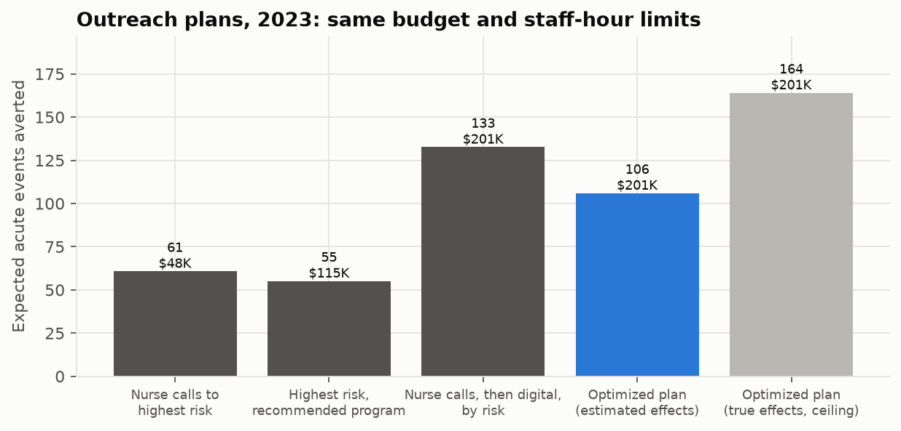
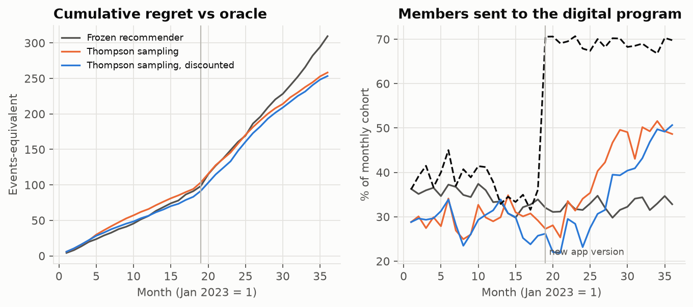
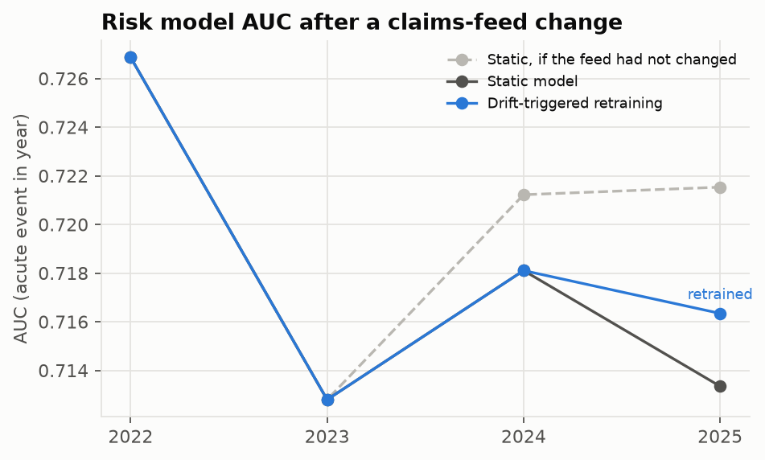
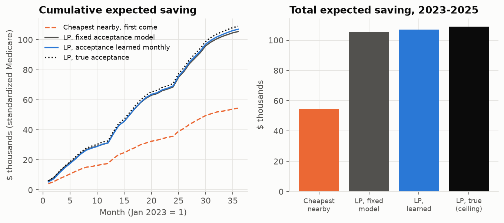

# Prescriptive care management: who to contact, with what, and how to keep learning

A care-management team has a budget, a fixed number of nurse and pharmacist hours, and thousands of members. Predicting who will end up in the emergency room is the easy half. The harder questions are prescriptive: **which members to contact, with which program, and how to keep getting better** as programs change and the data drifts. I built an end-to-end answer on about 11,000 synthetic North Carolina members, and checked every step against a known truth.

<!-- more -->

!!! abstract "TL;DR"
    - **Predict:** a deep learning model (a GRU over 24 months of utilization plus an MLP) reached **AUC 0.713**, ahead of gradient boosting (0.704; +0.009, 95% CI +0.002 to +0.016) and logistic regression (0.680).
    - **Prescribe:** uplift models trained on a randomized pilot, plus an integer program over five programs under budget, staff-hour and capacity limits, averted **74% more** expected acute events than nurse calls to the highest-risk members.
    - **The honest limit:** with true program effects, the same optimizer does much better. **Estimating effects from a one-year pilot, not optimizing, is the bottleneck.**
    - **Keep learning:** a contextual bandit (Thompson sampling) beat a frozen recommender by 34–53% across five seeds. Evidently drift monitoring and MLflow champion/challenger retraining caught a claims-feed change a year before labels arrived.
    - **Steer:** a capacity-constrained linear program sends members who need physical therapy to lower-cost real North Carolina providers. It nearly doubles savings over "recommend the cheapest nearby".

!!! warning "Synthetic members, simulated effects"
    The members come from Synthea, an open-source synthetic patient generator. No public dataset records how people respond to outreach, so program effects and member choices are simulated. That is also what lets every policy be scored exactly against the truth. The numbers show how the methods compare, not what a real program would achieve.

## Why synthetic data, and what is real

Real member-level claims are private, and so is any record of who got a nurse call and what happened next. Synthea generates realistic patients from disease models: conditions, encounters, medications and costs over each patient's lifetime. I generated 10,000 North Carolina patients aged 40 and over with 15 years of history. Each member contributes one row per year from 2015 to 2025: 108,300 member-years, with an 18% rate of ED visits or inpatient stays.

Two parts are real. The **physical therapists** in the steering step are every one in North Carolina in the CMS Physician & Other Practitioners file, with their real locations and payments. And the **payment-integrity guardrail** is the outlier score from my [Medicare FWA project](medicare-fwa.md).

Program effects are built the way semi-synthetic causal benchmarks (such as IHDP) are built. Each member has a real, synthetic untreated outcome. A program averts an event that would have happened with a member-specific probability. The effects differ by design, so the members at highest risk are not always the ones who benefit most:

| Program | Cost, staff time | Who it helps (hidden from the models) |
|---|---|---|
| Nurse call | $60, 1 h | Heart failure or COPD, recent acute use; less for under-55s |
| Pharmacist medication review | $150, 2 h | Five or more active medications, kidney disease |
| Home visit | $450, 4 h | The oldest members, heart failure or dementia |
| Digital coaching | $25 | Diabetes or obesity; engagement falls with age |

## Design choice 1: let the model see the timeline

Yearly counts flatten a lot of information. An ED visit last month and an ED visit 20 months ago look the same. So the risk model reads **24 months of utilization as a sequence**: ambulatory, urgent, ED and inpatient counts plus cost, fed through a GRU and combined with an MLP over tabular features (age, 12 chronic conditions, medications).

I benchmarked it against the methods a health plan would already use, on an out-of-time split: trained on 2015–2020, validated on 2021, tested on 2023.

| Model | AUC | Average precision | Top-decile lift |
|---|---|---|---|
| Logistic regression | 0.680 | 0.377 | 2.50× |
| Gradient boosting | 0.704 | 0.415 | 2.77× |
| **GRU + MLP (PyTorch)** | **0.713** | **0.436** | **2.96×** |

The margin over gradient boosting is small but real: a paired bootstrap puts it at +0.009 (+0.002 to +0.016). Every run is tracked in MLflow, and the winner is registered as the `champion` model.

## Design choice 2: high risk is not the same as high benefit

The obvious plan is to call the highest-risk members. But a program helps some members more than others, and the highest-risk member may be the one no program can help.

To learn who benefits, the simulation runs a **plan-wide randomized pilot** in 2022: every member (about 10,000) is randomly assigned to one of the five options. I compared four ways of estimating each member's benefit from each program: S-learner, T-learner, a doubly robust DR-learner, and a model anchored on the risk score. The choice among them used **pilot data only**. Because assignment was random, inverse-propensity weighting gives an unbiased estimate of how many events each learner's plan would prevent, cross-validated over five folds.

One result is worth stating plainly: the recommender picks the truly best program for only 28% of members, about chance for four programs. Effects this small (a few percentage points on an 18% base rate) are hard to learn from 10,000 randomized members.

## Design choice 3: optimize the whole plan, not member by member

The 2023 plan has $20 and 0.08 staff hours per member ($201K and 805 hours for 10,060 members), with at most 201 home visits. Choosing who gets which program under those limits is a **multiple-choice knapsack**, solved as an integer program with HiGHS:

```
maximize   Σ_i Σ_a  predicted benefit_ia · x_ia
subject to Σ cost_a · x_ia ≤ budget,   Σ hours_a · x_ia ≤ staff hours,   home visits ≤ 201,
           at most one program per member,   x ∈ {0, 1}
```



| Plan (same limits) | Events averted | Spend |
|---|---|---|
| Nurse calls to the highest-risk members | 61 | $48K |
| Highest risk, each given the recommended program | 55 | $115K |
| Nurse calls, then digital coaching, both by risk | 133 | $201K |
| **Integer program on estimated effects** | **106** | **$201K** |
| Integer program on the true effects (ceiling) | 164 | $201K |

The optimizer beats the usual practice by 74% (+59% to +92%). Nurse-only outreach runs out of staff hours after 805 calls and leaves most of the budget unspent. But **a simple rule beat the optimizer**: nurse calls by risk, then digital coaching for the next-highest-risk members. With the true effects the same integer program reaches 164, so the gap is the effect estimates, not the optimization. I added that simple baseline after seeing the first results and kept it in the table. The lever is a bigger pilot, or effect estimates pooled across years.

## Design choice 4: keep learning after launch

A plan fitted once can't notice when a program changes. So I let members arrive in monthly cohorts over 2023–2025 (36 months, 30,206 member-months). A **contextual bandit** picks a program for each member, sees whether an acute event followed, and updates: one Bayesian linear model per program, acting on a posterior draw for each member (Thompson sampling). The reward trades events averted against cost. In month 19 the digital program gets a new app version and becomes 2.5 times as effective.

Two things mattered in the build:

- **Sample per member, not per batch.** My first version drew one set of model weights per month, which moves the whole cohort at once. When the draw favored an expensive program, everyone got it that month. Drawing per member fixed that.
- **Tune exploration without peeking.** I chose how widely the policy explores (three settings) on months 1–12 only, and evaluated on months 13–36.

On months 13–36 the learning policy delivered **34–53% more value** than the frozen recommender in every one of five seeds. After the app update it moved members into the digital program (from 29% to 41% of each cohort); the frozen model stayed near 33%. The oracle moved to 69%, so there is still room left.



## Design choice 5: watch the inputs, not just the outputs

In January 2023 the simulation gets a claims-feed change: a new clearinghouse drops the place-of-service detail on 70% of facility claims, so ED visits and inpatient stays arrive as ordinary office visits. Labels, from adjudicated claims, are unaffected. This kind of upstream change is common, and it degrades a model silently.

Each year, before scoring:

1. **Evidently** compares the year's features with the model's training data.
2. Retraining triggers if an ED, inpatient or acute-history feature drifts, if 30% of features drift, or if AUC on the latest labeled year drops.
3. The first trigger marks a **change point**, and the challenger trains only on data since then. Older data no longer describes the inputs.
4. The challenger is logged and registered in **MLflow**. The `champion` alias moves only if it wins on a holdout.

| Year | Drift caught | Action | AUC, static | AUC, adaptive |
|---|---|---|---|---|
| 2024 | ED visits | Triggered, but no post-change labels yet; champion kept | 0.718 | 0.718 |
| 2025 | ED visits, acute history | Fine-tuned challenger wins on holdout (0.707 vs 0.704); promoted | 0.713 | **0.716** |

The drift was caught a year before any labeled post-change data existed, and the loop waited instead of retraining on stale inputs. The recovery is small (+0.003, interval −0.000 to +0.006). A challenger trained from scratch on the small post-change sample lost on the holdout and was correctly not promoted; fine-tuning the champion's weights is what made retraining worth it. Age and medication counts drift every year simply because the synthetic population ages. That is why the trigger watches the features that matter rather than a raw count of drifted columns.



## Design choice 6: steer members to high-value providers

The last step uses real providers. When a member needs physical therapy (after a fracture, sprain, ligament or tendon injury, or knee or hip arthritis), the plan can recommend one of North Carolina's 2,562 physical therapists. Each provider's cost is its real risk-adjusted Medicare payment per patient, which ranges from about $304 to $650 across the middle half. Members only save money if they accept, they're less likely to accept when the provider is farther away, and each provider has limited capacity.

Each month a **linear program** matches members to providers. It maximizes (chance of acceptance) × (savings), within 40 km, within each provider's remaining capacity, and never to a provider in the top 5% of the Medicare FWA outlier score. Low payment per patient is not value if the billing pattern is anomalous. The matching has integer solutions, so the LP answer is directly usable.

| Policy (2023–2025, five seeds) | Expected saving | Accepted |
|---|---|---|
| Recommend the cheapest provider nearby, first come | $54K | 31% |
| **LP, fixed acceptance model** | **$105K** | 56% |
| LP, acceptance learned monthly | $107K | 58% |
| LP, true acceptance (ceiling) | $109K | 59% |

Optimizing the assignment nearly doubles savings, because the cheapest provider is often too far for members to accept. Learning acceptance adds 1–2%, positive in every seed; the distance-only starting model was already close to the truth.



## What I took from it

- **Optimization pays most when the inputs are good.** Across outreach, audits and steering, the step from "rank and go down the list" to "optimize under constraints" gave the largest gains.
- **Estimating effects is the hard part.** When the optimizer lost to a simple rule, the cause was noisy effect estimates, and the true-effects ceiling showed exactly how much was left.
- **Learning online helps in proportion to how wrong you started.** Small gains when the starting model was close; larger when a program or a feed changed; none without forgetting old evidence.
- **Write the selection rule before looking.** Choosing learners on pilot data only, and tuning exploration on the first year only, kept the comparisons honest. Where I changed something after seeing results, the write-up says so.

## Engineering

- **One command runs everything:** `uv run care-outreach all` (build → risk → plan → bandit → monitor → steer), about 7 minutes on two CPU cores after generating the Synthea data.
- **MLflow** tracks every run across five experiments, with two registered models and aliases for champion/challenger.
- **Evidently** HTML drift reports are saved for each year.
- **Tests** cover the simulator, the knapsack and the steering LP's constraints. Dependencies are locked with `uv`.

## Limits

- **Members, effects, acceptance and the feed change are simulated.** Real effects would be smaller, noisier and slower to observe.
- **Real outcomes lag.** The bandit sees each month's outcomes before the next month's decisions; acute events really take months to show.
- **Costs and capacities are planning assumptions.** Payment per patient is a cost proxy, not a quality-adjusted price. Clinician quality scores (CMS Care Compare) would be the next input for steering.

The code, reports and MLflow setup are at [github.com/RonCom/care-outreach](https://github.com/RonCom/care-outreach).
