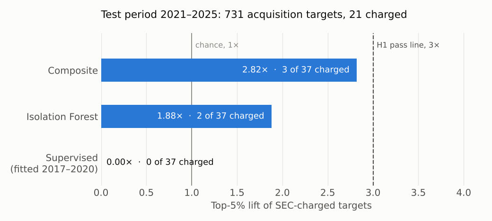

# Screening for trading before announcements, tested against SEC charges

Before a company announces a deal or its earnings, someone who knows the news can trade on it. A market-surveillance team asks "**which announcements had unusual trading beforehand?**" I built a screen that answers it from free public data, then asked a harder question: do the announcements the SEC later charged as insider trading rank at the top when the screen never sees the charges? The pass lines were written down before any data was pulled, and the test years were scored once. The main test failed.

<!-- more -->

!!! abstract "TL;DR"
    - **Data:** SEC EDGAR filings (176,485 earnings announcements and 1,860 confirmed acquisition targets, 2016–2025), SEC litigation releases for the labels, FINRA daily off-exchange short-sale volume, and daily stock bars with delisted tickers.
    - **Labels:** a local LLM (Ollama) read every SEC insider-trading release into a fixed schema; a 100-release hand-check set the accuracy gate (issuer 97.5%, announcement date 100%).
    - **Method:** pre-event features over the 20 trading days before each announcement, compared with peers by robust z-scores; a composite score, an Isolation Forest and a supervised model; a placebo window to catch scores that pick up stock traits.
    - **Result:** on 2021–2025, the best score put 3 of 21 charged targets in its top 5% (**2.82× lift against a 3× pass line, failed**; AUC 0.52). The placebo test passed and a 50-alerts-a-month budget caught 28% of charged events (pass line 25%).
    - **Why it failed:** where the SEC states share counts, the largest charged trade is a median **0.07%** of the stock's volume over the 20-day window. Daily data can't see a trade that size. This was found on development data and logged before the test run.
    - **Stack:** Python, DuckDB, pandas, scikit-learn, Ollama, pytest, uv. Code: [github.com/RonCom/insider-screen](https://github.com/RonCom/insider-screen).

!!! warning "Unusual trading isn't insider trading"
    A high score means trading before an announcement looked unusual against similar stocks. Leaks to the press, rumors and analyst work produce the same pattern legally. Charged events are a small, lagging sample of insider trading, and unlabeled events include uncharged cases.

## The question and the pass lines

The specification (`docs/spec.md` in the repo) was written before any data was pulled. It fixes the data sources, the event rules, the features, the split by date (development 2017–2020, test 2021–2025) and six expectations:

| ID | Test | Pass line |
| --- | --- | --- |
| H1 | Charged acquisition targets in the best score's top 5%, as a multiple of chance | ≥ 3× |
| H2 | AUC gain from options features | ≥ 0.03 |
| H3 | AUC gain from off-exchange short-sale features, earnings with a negative day-0 return | < 0.02 |
| H4 | Drop in small-cap share of alerts from shrinkage | ≥ 25% |
| H5 | Placebo window (days −70 to −51), top-5% lift | ≤ 1.5× |
| H6 | Share of charged events caught with 50 alerts a month | ≥ 25% |

Every rule changed after data was seen is in a dated change log at the bottom of the spec, with the reason. The test period runs only from code at a `freeze-*` git tag on a clean tree, and the command refuses to score it twice.

## Labels: reading SEC litigation releases with a local LLM

The SEC publishes a litigation release for each civil case it files. I downloaded releases from 2016 to 2026, kept the insider-trading ones, and had a local model (gemma4 through Ollama) extract a fixed schema validated with pydantic: issuer, ticker if stated, announcement date, instrument (stock, options, both), direction (long, short, or selling shares already held) and trade dates.

The spec set a gate of 90% accuracy on issuer and announcement date over 100 hand-checked releases. The prompt went through five versions, each driven by what the check found:

- Defendants who sold shares they already held before bad news didn't fit "long" or "short", so `sell` was added.
- One release can charge trades ahead of several announcements; merge rules keep them as separate events.
- Instrument answers were checked against the release text.

On the reviewed check, issuer scored 97.5% and announcement date 100%; event type 94.9%, instruments 86.4%, direction 83.1%. The final labels were re-extracted on the last prompt with the larger model's reasoning switched off (8 seconds a release instead of about 60) and a reasoning pass for releases where it named no company. That run scored 90.4% on issuer and 89.6% on date, one answer under the date gate; I accepted it and say so in the limits.

Releases are matched to events by company (current and former names mapped to SEC CIK) and announcement date within ±3 trading days.

## Events: what EDGAR's bulk file gets wrong

Events come from EDGAR's bulk submissions file: 176,485 earnings 8-Ks (Item 2.02) and 2,671 candidate acquisition targets (Item 1.01 with a merger agreement, filed by the target).

Two problems surfaced while profiling the data:

- **Timestamps.** The bulk file's acceptance times carry 0, 1 or 2 times the UTC offset, so the same filing can look like it came before or after the close. For targets, the exact time is read from each filing's index header. For earnings, day 0 is the earliest day consistent with EDGAR's hours, so the pre-event window never contains the announcement.
- **What counts as a target.** The rule also caught acquirers paying in stock, SPACs, asset sales and reverse mergers. A target now needs a tender-offer or going-private filing, or a delisting within 730 days; SPACs are dropped by SIC code and name. 1,860 targets remain, and 49 of the 51 charged targets survive.

## Day 0: when did the market learn the news?

The spec's check compared each 8-K's time with the market's first reaction in minute bars. It failed: 8 of 16 events differed by a session, mostly 8-Ks filed after the close. The replacement rule uses daily bars: it moves day 0 forward only for after-close filings with an announcement-sized move in the next session, and it flags earlier moves instead of moving day 0 onto them, so trading before a leak stays inside the window. A fresh sample of 20 scored 19 correct against a pass line of 18.

## Tickers: a dated map that includes dead companies

Features need each company's ticker on the event date, including companies that were acquired and delisted. The map is built from Massive (formerly Polygon) reference data, with FINRA volume to choose among a company's tickers, ticker lookups from press-release exhibits, and name matching.

Name matching went through three audits of 25 matches each. The first two found 5 and 6 wrong rows; each error pattern became a rule (the ticker must have traded around the event, no other company's events carry it that year, short names need an exact match). The third sample had no errors. Exchange test symbols and notes listed as common stock are filtered out. Coverage: 81% of targets and 92% of earnings events.

## Features and scores

Each feature compares days −20 to −1 against a baseline of days −250 to −31:

- abnormal volume, and the share of window volume in the last 5 days
- cumulative abnormal return from a market model fitted on the baseline
- off-exchange short share of volume from FINRA's daily files, against its own baseline

A unit test alters every row on or after day 0 and checks that no feature changes. Each feature becomes a robust z-score (median and MAD) within peers of the same event type, size quintile and sector, capped at ±5. The scores:

- **Composite:** the mean of the oriented z-scores.
- **Isolation Forest:** fitted on development-period events.
- **Supervised:** gradient boosting fitted on development labels (charged vs. unlabeled).

The placebo window (days −70 to −51) runs the same pipeline on a window with no news in it. If charged events rank high there too, the score is picking up something about the stocks, not the trading before announcements.

## What development data showed

On 2017–2020, none of the 9 charged targets reached the composite's top 5% (AUC 0.66). The top ranks were deals with visible run-ups from press leaks and rumors, which the SEC rarely charges because the information was already circulating.

So I looked at what was charged. Of 48 charged targets, 27 were traded in stock only, 10 in options only, 4 in both, and 7 aren't stated. Where a release gives a share count, I divided the largest charged trade by the stock's volume over the 20-day window. The median is 0.07%. None reaches 5%; the largest, TravelCenters, is 2.3%. Stated profits run from $31,000 to $5.2 million.

A trade that small doesn't move daily volume, returns or short share. That went into the change log on 2026-10-09, before the test period was scored.

## Test results, 2021–2025

| ID | Result | Verdict |
| --- | --- | --- |
| H1 | 2.82× (composite: 3 of 21 charged targets in the top 37 of 731) | Failed |
| H2 | No free source of expired option contracts | Not tested |
| H3 | +0.097 (0.852 to 0.949), on 3 charged events | Failed, no evidence either way |
| H4 | Shrinkage was defined on options trading days | Not tested |
| H5 | 0× (0 of 37) under every score | Met |
| H6 | 28% (7 of 25), targets and earnings | Met |

**H1.** At random, the top 37 would hold about 1.1 charged targets. The composite's 3 happens by chance about 9% of the time (Poisson), and an AUC of 0.517 says it doesn't rank charged targets above the rest as a group. The supervised model, fitted on development labels, caught none.

**H5.** No score put a charged event in its placebo top 5%. The composite's placebo AUC is 0.386: charged targets were, if anything, quieter than other targets two to three months before their announcements.

**H3.** Adding the short share raised the earnings composite's AUC from 0.852 to 0.949, past the 0.02 line. There are 3 charged events among 40,682 negative-return earnings announcements, so one event moving a few thousand places changes the AUC by tenths. The spec's 2024–2025 re-test would rest on one or two events. I report it as failed against its threshold, with no claim that off-exchange data helps.

**H6.** The top 50 events each month across targets and earnings, about 4% of the roughly 1,300 scored a month, caught 7 of 25 charged events. Targets and earnings compete on composites that are each a robust z within their own peers; how those compare across event types wasn't checked.

**Label lag.** SEC charges trail trades by years. The test period has 7, 5, 6, 3 and 0 charged targets for 2021 through 2025, so a score that found 2025's insider trading would get no credit for it yet.

## What it would take

The screen measures abnormal trading before announcements, and in this data the SEC-charged trades aren't where that trading comes from. Options are where a small trade stands out, because a single contract trades far less than the stock. Options data was the one source dropped, because no free source has expired contracts back to 2017, and H2 would have tested exactly that channel. Trade-level data (FINRA's monthly short-sale transaction files, or the consolidated tape) is the other route; the loader exists, but the files run to a few hundred gigabytes for two features.

## Engineering

- **One DuckDB file per loader**, so long downloads and the LLM extraction run side by side without lock conflicts.
- **140 tests**, including the no-look-ahead test on every feature.
- **SEC requests** carry a declared User-Agent and stay under EDGAR's 10-a-second limit.

## Limits

- **Small counts:** 21 charged targets in the test period and 9 in development. One event more or less in the top 5% moves the lift by about 1×.
- **Lost charged targets:** 48 passed the target audit and 30 were scored. The rest had no ticker or price bars, traded under $1, were ADRs, or fell in 2016.
- **Broken deals left out:** the audit keeps deals confirmed by a tender offer, going-private filing or delisting, which lost two charged events (Lattice Semiconductor, Skyline–Champion).
- **Labels from one local model,** one answer under the date gate.
- **No market cap:** no free source of historical shares outstanding, so size peers use dollar volume and the $50 million floor wasn't applied.
- **Not covered:** other material 8-Ks (Items 7.01 and 8.01) weren't scored.

The code, spec with change log, and full results are at [github.com/RonCom/insider-screen](https://github.com/RonCom/insider-screen).
