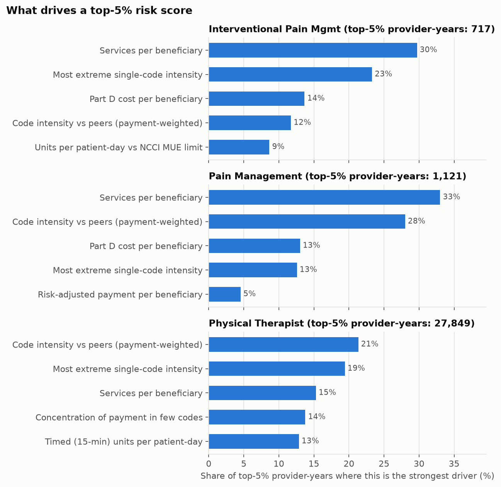
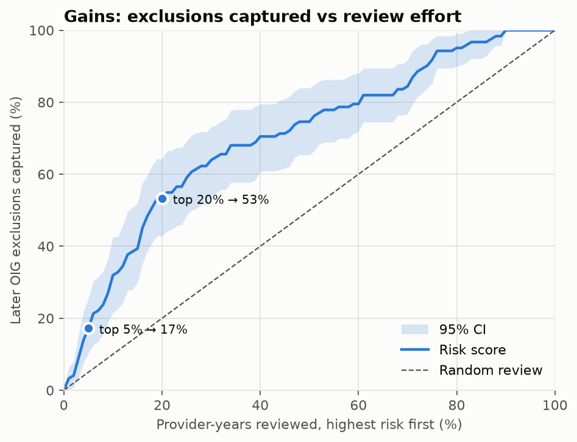
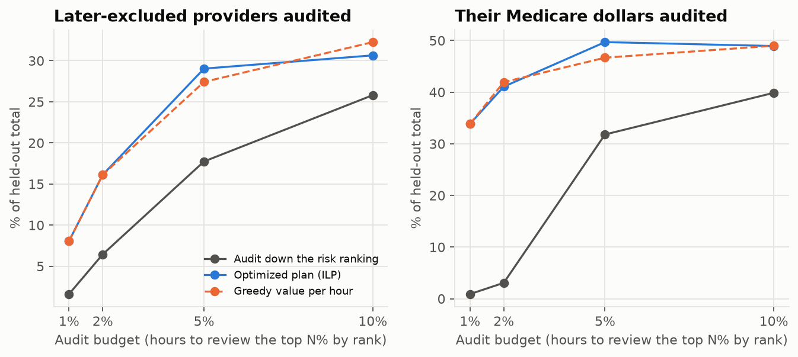
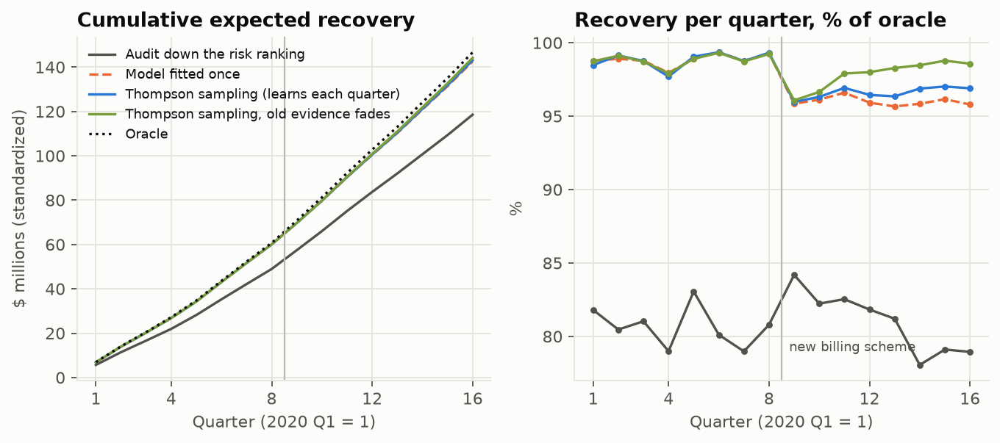

# Finding outlier Medicare providers with public data

Payment integrity teams have far more claims than reviewers, so the working question is "**which providers should a reviewer look at first?**" I built an end-to-end pipeline that answers it from public CMS data, and tested whether its ranking points toward providers the HHS Office of Inspector General (OIG) later excluded from Medicare.

<!-- more -->

!!! abstract "TL;DR"
    - **Data:** CMS Medicare Part B and Part D provider summaries, 2016–2024; 594,765 provider-years across three specialties (Interventional Pain Management, Pain Management, Physical Therapists).
    - **Method:** compare each provider to peers in the same specialty and year using robust statistics, adjust for low volume, combine transparent rules with an Isolation Forest, and give every flag plain-language reasons.
    - **Result:** the score ranks providers later excluded by OIG well above chance: **AUC 0.71 (95% CI 0.64–0.76)**. The top 5% of the list holds **3.4×** the random share of later-excluded providers; the top 20% holds 53% of them.
    - **What didn't beat it:** supervised XGBoost, case-mix adjusted peers, and two other outlier detectors — including one that failed a test I wrote down before seeing the data.
    - **From a list to an audit plan:** an integer program that chooses whom to audit under a fixed hour budget covered **50% vs 32%** of later-excluded providers' Medicare dollars on held-out years, with 25% fewer audits. A policy that learns from its own audits (a contextual bandit, tested on simulated audit findings) beats a model fitted once by 2% over 2022–2023, after a new billing pattern starts predicting findings, and by 5–8% when that pattern is stronger.
    - **Stack:** Python, dbt (running on both DuckDB and Snowflake, reconciled row for row), Streamlit, uv. Code: [github.com/RonCom/medicare-fwa](https://github.com/RonCom/medicare-fwa).

!!! warning "Outliers are not fraud"
    A high score means a provider bills differently from peers. A specialized practice or a sicker patient population can produce the same pattern legitimately. The score orders a review queue; it doesn't establish wrongdoing. No individual providers are named here.

## Why this problem, and why public data

Health plans screen for fraud, waste and abuse (FWA) by comparing each provider with similar providers in their own claims. A physical therapist who bills twice as many 15-minute units per patient visit as nearly every other physical therapist is worth a look, whatever the reason turns out to be. CMS publishes enough aggregated data to run a version of this in the open, so anyone can rerun and check it.

The data:

| Source | Contents | Use here |
|---|---|---|
| CMS Physician & Other Practitioners (by provider, and by provider and service) | Services, beneficiaries, payments, and counts by billing code for each provider | Utilization, coding and billing-pattern metrics |
| CMS Part D Prescribers | Drug claims and costs per prescriber | Opioid, long-acting opioid, brand-name and cost metrics |
| NCCI Medically Unlikely Edits (MUE) | CMS's maximum units per code per patient per day | A check on units billed against the limit |
| OIG List of Excluded Individuals/Entities (LEIE) | Providers barred from federal programs, with dates and reasons | The validation label |

I limited the scope to three specialties. That kept downloads small (the API is paged with a specialty filter, so there's no multi-gigabyte file to pull) and meant each metric could target codes the specialty bills, such as timed therapy units for physical therapists.

## Design choice 1: compare providers to their own peers

A pain physician and a physical therapist bill completely different codes, and billing norms drift from year to year. So every metric is compared **within specialty × year**. A provider is unusual only if they are unusual relative to people who do the same work in the same year.

Validation needs the same split (below): exclusion rates differ about 20-fold between specialties, so pooled scores aren't comparable.

## Design choice 2: robust statistics, not the textbook bell curve

The classic approach is a z-score: how many standard deviations a provider sits from the mean. Claims metrics are heavily right-skewed, so the extreme billers inflate the mean and standard deviation and partly hide themselves. I kept the classic z and percentile for display, but scored with a **robust z** based on the median and the median absolute deviation (MAD), which the outliers barely move.

The chart shows why: the bulk of physical therapists sit in a tight hump, and a long tail stretches far to the right. That tail is where review attention should go, and a mean-based z-score understates how far out it is.

## Design choice 3: don't let small providers dominate

A provider with 15 patients can post an extreme rate by chance. Left alone, the top of the list fills with tiny practices whose numbers are mostly noise. I used **empirical-Bayes shrinkage** (Bühlmann credibility): each provider's rate is pulled toward the peer median in proportion to how little data backs it up.

A rate from 20 patients gets less weight than the same rate from 2,000 patients. The amount of pull (*k*) is estimated from the data for each metric, specialty and year; it isn't set by hand. Insurance pricing uses the same method, and it made the top of the list noticeably less dominated by low-volume providers.

## Design choice 4: metrics that map to known schemes

Each metric corresponds to a known billing scheme, so a flag tells an investigator which scheme to check.

| Metric | Scheme it points to |
|---|---|
| Services per beneficiary; service days per beneficiary | Over-utilization, excess visits |
| Risk-adjusted payment per beneficiary | Cost outliers after case mix and geography |
| Share of level 4–5 office visits | Upcoding |
| Code intensity (units per patient for specific codes) | Excessive units of a procedure |
| Timed units per patient-day | More 15-minute therapy units than a session supports |
| Units per patient-day vs the NCCI MUE | Billing at or above CMS's per-day limit |
| Share of passive modalities; concentration in few codes | Low-value services, narrowed high-yield billing |
| Opioid share, long-acting share, brand share, drug cost | Prescribing risk |

Many codes have an MUE of 1 unit per day, so "at or above the limit" is true for almost everyone who bills them and separates no one. I scored only codes whose limit is 2 or more.

## Design choice 5: transparent rules first, a model second

The score has two parts:

1. **Rules:** the average of each provider's three largest robust z-scores. A provider is flagged when it passes 3.5. A reviewer reads it as: "services per patient and units per visit are both far above peers."
2. **Isolation Forest**, fit separately for each peer group, to catch **unusual combinations** that no single metric shows.

The final score is a **2:1 weighted average** of the two, each first turned into a within-group percentile. I fixed that weighting before looking at validation results, so it couldn't be tuned to the answer. Every provider carries its top three drivers in plain language; that's the text a reviewer reads.

## Design choice 6: a validation label that doesn't cheat

There's no public "confirmed fraud" label. The closest is the OIG exclusion list. I defined a positive as a provider **excluded within three years after the data year**, matched by the same NPI (national provider ID). The ranking is built from year *Y* data and tested against what happened after *Y*, which is how it would be used.

Four traps came up while building this, and catching them changed the numbers more than any model change did:

- **Pooling inflates results.** Scoring all specialties together gave an AUC of 0.78, but mostly because one specialty has both higher scores and far more exclusions. Measured within specialty, it's 0.71. All results here are within-group.
- **Name matching adds noise.** Some LEIE rows have no NPI. Matching those by name and state added more false matches than true ones (AUC fell to 0.66), so it is reported only as a sensitivity check.
- **The current list forgets people.** The LEIE drops providers once they are reinstated, which would relabel some excluded providers as never excluded. I rebuilt a cumulative history from archived snapshots (via the Internet Archive) plus OIG's monthly supplements.
- **Providers repeat across years.** The same provider appears up to nine times. Confidence intervals come from a bootstrap that resamples **providers**, not provider-years, so the same person doesn't count as independent evidence nine times.

## Results

Over 2016–2024 there are 67 providers excluded within three years of a scored year. That is a small number, so the intervals are wide and I report them everywhere.

| | AUC | Top 5% lift | Top 5% recall |
|---|---|---|---|
| **All three specialties** | **0.71 [0.64–0.76]** | **3.4× [2.1–5.1]** | 17% |
| Fraud-related exclusion types only | 0.72 [0.64–0.79] | 3.6× | 18% |
| Physical Therapists | 0.72 [0.62–0.83] | 5.9× [2.9–9.3] | 29% |
| Pain Management | 0.72 [0.64–0.81] | 2.0× | 10% |
| Interventional Pain Management | 0.66 [0.50–0.78] | 2.6× | 13% |

Reading it: if you pick one later-excluded provider and one who was not, the score ranks the excluded one higher 71% of the time. A reviewer working the top 5% of the list would reach 17% of later exclusions, 3.4 times what a random 5% would give; working the top 20% reaches 53%.

The result holds year by year (AUC between 0.62 and 0.83 for each data year from 2016 to 2024), and it holds for fraud-related exclusion types alone. Utilization metrics carry most of the signal: services per beneficiary, code intensity, units per patient-day and MUE headroom.

With only 2021–2024 data, Interventional Pain Management looked like the strongest specialty. Adding 2016–2020 erased that: it was small-sample noise, inside the wide intervals.

## What didn't work

I tested ideas from two published papers[^jk][^hamid] against a **frozen** copy of the baseline. A change would be adopted only if it beat the baseline within specialty with non-overlapping intervals.

| Idea | AUC | Verdict |
|---|---|---|
| Baseline (rules 2 : Isolation Forest 1) | 0.70 | Kept |
| Supervised XGBoost, cross-validation grouped by provider | 0.65 | Trails baseline |
| XGBoost trained on 2016–2019, tested on 2020–2024 | 0.67 | Trails baseline |
| Peers adjusted for patient case mix | 0.67 | Not adopted |
| Rules + ECOD detector | 0.70 | No gain |
| Rules + CBLOF detector | 0.72 | Failed pre-registered test |

**Supervised learning** improved as labels grew (from near chance with 29 positives to 0.65–0.67 with 67) but still trailed. With 67 positives, a model that learns from labels has little to learn from; an unsupervised peer comparison doesn't need them. With audit outcomes as labels, that would likely flip.

**CBLOF** looked better than Isolation Forest in three runs on 2021–2024. But those runs shared the same labels, so they were not independent evidence. Before downloading 2016–2020, I wrote down a test in the repository: CBLOF replaces Isolation Forest only if it wins on the new, held-out 2016–2019 years. It didn't (AUC difference +0.009, interval −0.013 to +0.032). Isolation Forest stayed. Without the written rule, I'd have adopted a result that didn't replicate.

**Why published results look better.** One paper reports much higher accuracy on similar data. I rebuilt its setup on my data and changed one thing at a time:

| Step | AUC |
|---|---|
| Their setup: all specialties pooled, rows split randomly | 0.93 |
| Keep each provider entirely in training or test | 0.82 |
| Rank within specialty-year | 0.66 |
| Predict *future* exclusions | 0.62 |

Most of the headline number came from the same provider appearing in both training and test data, and from pooling specialties with different base rates. Under the same strict test, the unsupervised baseline keeps 0.70. The evaluation changes moved AUC by 0.31; no model change in this project moved it by more than 0.05.

I also audited a popular Kaggle "healthcare fraud" dataset as a possible second benchmark. It turned out to be synthetic: one ratio column alone separates the fraud label (AUC 0.99), clinical fields carry no signal, and its provider IDs aren't NPIs, so it can't be linked to real providers. I didn't use it.

## From a ranked list to an audit plan

A ranking answers "who looks most unusual?" An investigations unit has a different question: **"with this many staff hours, whom do we audit?"** Walking straight down the ranking ignores three things. Some specialties are excluded about 20 times as often as others, but a within-specialty percentile can't see that. Some providers put far more dollars at stake. And a large practice takes longer to review than a small one.

So I turned the ranking into an audit plan:

1. **Calibrate.** Convert each provider's within-specialty percentile into a probability of later exclusion, using logistic regression with one intercept per specialty, fitted on 2016–2019 only. On the held-out years it predicts 55 exclusions; 62 happened.
2. **Value and cost.** Expected value = probability × standardized Medicare payment. Audit hours grow with the size of the patient panel. These hours are planning assumptions, stated in the config.
3. **Optimize.** An integer program (SciPy / HiGHS) maximizes expected value subject to the hour budget, a coverage floor for each specialty, and no back-to-back audits of the same provider.

The test gives the plan the same hours the top-5% review list would need, on held-out years 2020–2023:

| Plan (same 333,000 audit hours) | Audits | Later-excluded caught | Their dollars covered |
|---|---|---|---|
| Audit down the ranking | 14,312 | 11 (18%) | 32% [10–47%] |
| **Optimized plan** | **10,690** | **18 (29%)** | **50% [34–61%]** |

The dollar gain is +18 points, with an interval (+5 to +39) that clears zero. The count gain (+11 points, −2 to +25) has an interval that includes zero at this sample size. At smaller budgets the gap is wider: at the top-1% budget the plan reaches 34% of the dollars, against 1% for the ranking.

### A policy that learns from its own audits

The plan above is fitted once. An investigations unit would learn from each quarter's audits and re-plan. Only audited providers reveal a result, which makes this a **contextual bandit** problem (one-step reinforcement learning): the policy balances auditing providers it's confident about against learning about the rest.

**Why the audit findings had to be simulated.** Exclusions are far too sparse to learn from. The held-out years contain 62 later-excluded provider-years among 285,039, and a quarter's audit list holds fewer than one of them on average. No policy can update on one data point a quarter; any difference would be noise. Audits also find overpayments, unsupported units and upcoding that never reach exclusion, but those results aren't public. So I simulated each audit's finding from the same billing outliers the score measures, through weights the policy never sees. Later-excluded providers are near-certain findings. That gives about 555 findings a quarter to learn from. From 2022, a new pattern appears: billing for passive or unattended treatments starts to predict findings.

Five random seeds, 16 quarters:

| Policy | Expected recovery | vs ranking |
|---|---|---|
| Audit down the ranking | $118.5M | – |
| Model fitted once on 2016–2019 audits | $142.6M | +20% |
| Thompson sampling, updated each quarter | $143.1M | +21% |
| **Thompson sampling, old evidence fades** | **$144.2M** | **+22%** |
| Oracle (knows the truth) | $146.7M | +24% |

Most of the gain comes from **modeling what audits find**: the model fitted once gets +20% of the +22%. Learning each quarter adds gain only when patterns change, and **only if old evidence fades**: over all 16 quarters the fading version beats the frozen model by 1.0–1.2%, and over 2022–2023, after the shift, by 2.0%, winning in every seed. The plain learner barely moved, because four years of history outweighed a few quarters of new audits. I added the fading version after seeing that, and I report it that way. When the new pattern was made stronger, the fading version's post-shift gain over the frozen model grew from 2% to 5–8%.

These results use actual providers with a simulated outcome. They compare the methods with each other; they don't estimate what an audit program would recover.

## Engineering: built like it would be run

- **dbt models run on DuckDB locally and on Snowflake.** The same SQL builds staging tables and a provider-year feature mart in both, with tests for keys and one row per provider-year. A reconciliation step compares every column: all 594,765 provider-years match.
- **Snowflake set up like production:** a service user with key-pair authentication, a dedicated role and small warehouse, and a resource monitor capping spend.
- **Reproducible:** `uv` locks dependencies; one command runs download → load → transform → score → validate. A synthetic-data mode runs the whole pipeline offline in about 30 seconds.
- **A Streamlit dashboard** shows peer distributions, a review queue with drivers, and the method. Providers appear under pseudonymous IDs.

## Limits

- **The label is noisy.** Exclusion lags misconduct by years and captures a small fraction of FWA.
- **Aggregates hide claim-level patterns.** Modifier misuse (such as 59/X modifiers to bypass bundling edits), date-of-service patterns and diagnosis coding all need claim lines, which public data does not provide.
- **Small providers are missing.** CMS suppresses counts under 11 beneficiaries.
- **Peers are national.** State or practice-setting peers might change results.
- **67 positives is few.** The intervals are wide: AUC 0.64–0.76 overall, 0.50–0.78 for Interventional Pain Management.

## What I'd do with a health plan's data

Claim lines would allow modifier and edit-bypass checks, episode-level patterns and referral networks. Audit and recovery outcomes would give a much richer label than exclusions (they would replace the simulated findings above), and at that point a supervised layer on top of these peer features becomes worth building.

The code, results, and full experiment log are at [github.com/RonCom/medicare-fwa](https://github.com/RonCom/medicare-fwa).

[^jk]: Johnson, J. M. & Khoshgoftaar, T. M. (2023). Data-Centric AI for Healthcare Fraud Detection. *SN Computer Science* 4:389.
[^hamid]: Hamid et al. (2024). Healthcare insurance fraud detection using data mining. *BMC Medical Informatics and Decision Making* 24:112.
