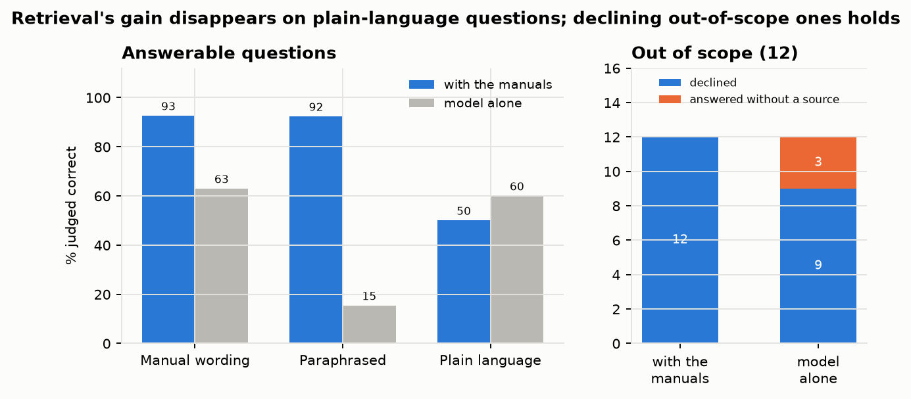

# Answering Medicare billing-policy questions with a local RAG system

A payment-integrity reviewer who sees a flag such as "timed therapy units averaging under 15 minutes" needs the
policy that applies, with a citation they can check. I built a small retrieval-augmented generation (RAG) system that
answers billing-policy questions from four CMS manuals using local models, cites a manual section for every claim, and
declines when the manuals don't cover the question. Then I measured it: retrieval, answers, declines, and the LLM judge
itself.

<!-- more -->

!!! abstract "TL;DR"
    - **Corpus:** four CMS manuals (NCCI Policy Manual chapters 1 and 11, Medicare Benefit Policy Manual chapter 15, Claims Processing Manual chapter 5), split into 851 section-aware chunks.
    - **Stack:** Ollama (`nomic-embed-text`, `gemma4:e4b`, `gemma4:26b` as judge), DuckDB, BM25 + embeddings fused with reciprocal rank fusion, MLflow. Everything runs on a laptop with an 8 GB GPU.
    - **Answers:** 84% judged correct with retrieval vs 50% for the same model without documents; 12 of 12 out-of-scope questions declined.
    - **Retrieval:** keyword search found the right section for 100% of questions written in the manuals' wording but only 40% of plain-language ones; embeddings reached 70% on those.
    - **Weak spot:** plain-language questions score 45% correct vs 92-93% for the rest, and there retrieval does no better than the model alone. That sets what to tune and what to monitor.
    - **Judge:** calibrated against 37 hand labels; correctness agreement 92%, Cohen's κ 0.68.
    - **MLOps:** MLflow traces every answer and runs a chunking sweep with a rule fixed in advance; Evidently watches label-free retrieval signals for drift and feeds a review queue.
    - **Code:** [github.com/RonCom/policy-rag](https://github.com/RonCom/policy-rag).

## Why this problem

My [Medicare FWA project](medicare-fwa.md) flags providers whose billing is unusual: units per patient-day near the
Medically Unlikely Edit, timed therapy units well above peers. The next question a reviewer asks is what the rule
actually says. The answers are in long, dense manuals, and a general chatbot will answer confidently without saying
where the answer came from. For review work, an answer without a source is not usable, and an invented one is worse.

So the requirements were narrow:

1. Answer only from the manuals.
2. Cite the section for every claim.
3. Say "not in these documents" when they don't cover the question.
4. Measure all three, rather than judging from a few good-looking examples.

## Design choice 1: chunk by the manuals' own structure

The manuals have their own sections: NCCI chapters use lettered sections ("V. Medically Unlikely Edits"), the CMS
manuals use numbered ones ("§20.2 Reporting of Service Units With HCPCS"). Chunks follow those sections, in pieces of
about 300 words with 40 words of overlap, so a citation points to a section a reviewer can look up.

Getting the sections right took more care than expected. The manuals open with a table of contents, body text quotes
other sections ("see 220.2 - Reasonable and Necessary Outpatient Rehabilitation Therapy Services)"), and one chapter
lists a run of section titles in the middle of a paragraph. My first version treated those as headings, and one
section swallowed 140 chunks. The fix: a line counts as a heading only if it is one of the next few entries in the
manual's own table of contents. Running headers, page labels and the revision history at the end are dropped. The
result is 851 chunks across 304 sections.

## Design choice 2: two kinds of search, combined

Billing policy is full of exact tokens: CPT codes, "modifier 59", "8 minutes", section numbers. Keyword search (BM25)
matches those well. People don't always ask in the manuals' words, though, and embeddings handle paraphrase. The
system runs both and combines the rankings with reciprocal rank fusion (hybrid search). Vectors are stored in DuckDB.

## Design choice 3: constrain the answer

The answering model sees five numbered excerpts and is told to answer only from them, cite each claim as `[n]`, and
reply `NOT IN DOCUMENTS` otherwise. A typical answer:

> **Q:** How many 15-minute units should be billed for 47 minutes of timed therapy (24 minutes of 97112 and 23 of 97110)?
>
> **A:** The total timed code treatment time of 47 minutes falls within the range for 3 units (38 to 52 minutes) [1].
> The correct coding is 2 units of code 97112 and one unit of code 97110, assigning more timed units to the service
> that took the most time [1].
>
> *[1] Claims Processing Manual Ch. 5, §20.2*

## Design choice 4: a test set that can fail

The evaluation has 62 questions. Fifty are answerable, each with a reference answer, its key facts, and the section
that contains them, checked against the manual text. Twelve ask about things the manuals don't
cover (Part D penalties, MS-DRG weights, MIPS thresholds, Medicare Advantage risk adjustment), and I confirmed each
topic is absent from the corpus.

My first 40 answerable questions were drafted from the manual text, and that turned out to matter. Keyword search
scored 100% on them, because the questions reused the manuals' wording. So I added 10 questions in the way a reviewer
might actually ask:

- "A PT clinic billed four quarter-hour blocks for about 50 minutes of hands-on work. Is that right?"
- "Does Medicare stop paying for therapy once the patient stops getting better?"
- "Can a chiropractor get paid for an X-ray they take to show a spinal problem?"

## Results: retrieval

A hit means a chunk from the gold section is among the top results.

| Method | Top 1 | Top 5 | Top 5, manual wording (40) | Top 5, plain language (10) |
|---|---|---|---|---|
| Keyword (BM25) | 76% | 88% | 100% | 40% |
| Embeddings | 70% | 90% | 95% | **70%** |
| **Hybrid** | **76%** | **92%** | 100% | 60% |

The plain-language questions changed the picture. Keyword search, perfect on manual wording, found the right
section for only 4 of 10 everyday questions; embeddings found 7. Hybrid keeps keyword search's precision on exact
terms and most of the embedding gain, which is why it answers questions here. With 10 plain questions, though, the
ranking among methods is suggestive, not settled.

**What this changes.** Hybrid stays the default; dense leads on plain language by one question in ten, which is
not evidence. Everyday wording is the failure mode, so it is what monitoring watches (below) and where the test
set needs more questions.

## Results: answers

| | With retrieval | Same model, no documents |
|---|---|---|
| Judged correct (answerable questions) | **84%** | 50% |
| Declined the 12 out-of-scope questions | **12 / 12** | 9 / 12 |
| Declined an answerable question | 3 / 50 | – |
| Cited a gold section when answering | 89% | – |

Retrieval raises correctness from 50% to 84%, and every claim is tied to a section. Without the documents, the model
answered three out-of-scope questions (Part D penalties, Medicare Advantage risk adjustment, ACO benchmarks) from
general knowledge. Those answers were broadly reasonable, but nothing in them could be checked against a source, which
is the property a reviewer needs.

Breaking the results down by how a question is worded tells a sharper story than the averages.

Eleven of the 50 answerable questions fall short of fully correct. Four are retrieval misses, all on plain-language
questions, and all four answers were wrong. Asked whether Medicare stops paying once a patient stops improving, the
system retrieved a section on notifying beneficiaries instead of §220.2's rule on maintenance therapy, and answered
"yes"; the manual's answer is "not necessarily." The other seven had the right section and still fell short, mostly
by leaving out a secondary fact such as the 14-day signature rule for verbal certifications. Plain-language
questions score 45%; the other 40 score 92-93%.

**What this changes.** A miss became a wrong answer every time, so retrieval is the first thing to tune. But more
points are lost with the right section in hand, so the answer step is next. My working hypothesis is that the
1-4 sentence limit in the prompt drops secondary facts; that is a prompt change to test with the judge, tracked
by prompt hash.

Retrieval lifts manual-wording questions from 63% to 93% and paraphrased ones from 15% to 92%, and keeps every
out-of-scope question declined. On plain-language questions the gain disappears: 50% with the manuals, 60%
without. Ten questions is too few to call that a loss, but it is the worse failure: a wrong answer from the wrong
section arrives *with a citation*, which looks more trustworthy than an unsourced guess.

**What this changes.** Everyday questions need better retrieval before their answers can be trusted. A guard to
test later: when the monitoring signals say retrieval is unsure, decline or flag instead of answering.

## Results: can the judge be trusted?

Correctness and faithfulness were graded by a larger local model (`gemma4:26b`) than the one answering. An LLM judge
is only useful if it agrees with a person, so I labeled 37 answers by hand, choosing a mix of errors, partial answers
and declines, and compared:

| | Agreement | Cohen's κ | Judge pass rate | My pass rate |
|---|---|---|---|---|
| Correctness | 92% (34 / 37) | **0.68** | 86% | 84% |
| Faithfulness | 97% (36 / 37) | – | 97% | 100% |

Correctness agreement is substantial (κ above 0.6), so the 84% figure stands. For faithfulness, every answer I
labeled was faithful, so κ has no variation to measure and agreement is the meaningful number.

The disagreements showed a pattern. The judge accepted two "NOT IN DOCUMENTS" replies because the excerpts it was
shown lacked the answer, even though the manuals contain it. It grades against what was retrieved, so a retrieval miss
can look like a correct decline. A deterministic check (did retrieval return the gold section?) catches those cases,
which is a good reason not to rely on the judge alone.

**What this changes.** The judge grades correctness at scale, but every decline is also checked against whether
retrieval found the gold section. The calibration holds for one judge model and one judge prompt; changing either
means labeling a fresh sample.

Defining the labels mattered too. On my first pass I scored two wrong answers as "unfaithful" because they were
wrong, but they accurately quoted the (wrong) sections they were given. Faithful means supported by the excerpts, not
true; correctness is scored separately. Writing that rule down before labeling is the difference between a measured
judge and an impression of one.

## Feature engineering, and what each feature is worth

In a RAG system the features are how documents and queries are represented for search. I made each choice for a
reason, then tested it the plain way: remove one feature at a time and re-score retrieval on the same 50
questions.

| Feature | Why it's there | Recall at 5 without it |
|---|---|---|
| Table-of-contents check on headings | Cross-references look like headings | **80%** (from 88%); 4 questions lost, none gained |
| Section-aware chunks | Citations must point to one section | 90%, but a third of section-blind windows span two or more sections and can't be cited to one |
| Section heading in the chunk | Names the topic in the manual's terms | Keyword 88% (unchanged); embedding 92% (from 90%), but top 1 falls from 70% to 58% |
| Tokenizer keeping "220.2", "g-codes" | Section numbers and codes are exact evidence | 88% (top 10: 96% to 92%) |
| Stopword removal | Common words carry no topic | 88% |
| Embedding task prefixes | The model was trained with them | 92% (from 90%); slightly *better* without them |

The one feature that clearly earned its place is structural: without the table-of-contents check, the parser
finds 311 sections instead of 304, and four questions lose their gold section. The token-level choices didn't
move top-5 recall on this test set. They stay as sensible defaults, but they aren't where the next gain is.

Two embedding-side results ran against the documentation. The section heading barely matters at top 5, but it is
what puts the right section first (70% vs 58% at rank 1), and that is what hybrid fusion rewards, so it stays.
The task prefixes that `nomic-embed-text` recommends made retrieval slightly *worse*: one question better
without them, with an interval that touches zero. That isn't enough to switch on, but it is the cheapest change
to test in the next full eval.

**What this changes.** The weak spot is plain-language questions, and that is a query-side problem: a reviewer
asks about a doctor "signing off" on a therapy plan, while the manual says "certification of the plan of care."
The next feature to try is a small glossary that maps everyday terms to the manuals' vocabulary before keyword
search. It gets the same treatment: an ablation on plain-language questions, once there are more than ten of them.

## Tracking and monitoring: MLflow and Evidently

An evaluation is a snapshot. Two questions remain once the system is in use: which configuration is running and
why, and whether it still works on the questions people actually ask. I used MLflow for the first and Evidently for
the second, and the design choices were mostly about keeping both honest at this scale.

**Every answer is a trace.** Each question is logged as an MLflow trace with three spans: `rag`, `retrieve` (the
five excerpts with section, page, rank and score) and `generate` (prompt version and reply). Three kinds of scores
are attached to the same trace: a deterministic check (did retrieval return the gold section?), the LLM judge's
grade with its reason, and my hand label. When the judge and I disagree, I open one trace and see what the model
was shown; that is where the judge's leniency on declines after a retrieval miss becomes obvious.

**Runs carry their lineage.** Each eval run logs the models and chunking settings, plus hashes of the question file
and both prompts, and the git commit. The question set grew from 52 to 62 during this project; without the hash,
two accuracy numbers from different question sets look comparable when they aren't.

**The chunk size gets tested, not defended.** I had picked 300-word chunks by judgment. `policy-rag sweep` tries
five chunkings with all three retrievers as nested MLflow runs. It sweeps retrieval only, because retrieval is
deterministic and cheap while answer grading takes hours on an 8 GB GPU, and a retrieval miss became a wrong
answer every time. The selection rule is in the config before the run:

1. the top five excerpts must fit a 3,000-word budget, since bigger chunks raise recall partly by showing the
   model more text;
2. rank by recall at 5, then plain-language recall, then MRR;
3. change the setting only if the bootstrap interval for the gain is above zero.

With 50 questions, one question is two points, so the third rule does most of the work.

**Monitoring without labels.** Nobody grades answers in use, so accuracy can't be watched directly. What can be
measured on every query is how it looks and how confident retrieval is:

- the share of query words that never appear in the manuals;
- the best keyword and embedding scores;
- whether keyword and embedding search agree on the top five;
- how scattered the top five are across sections.

`policy-rag monitor` first checks that each signal predicts a retrieval miss or an out-of-scope question on the
labeled set; a drift alarm on a signal that doesn't predict failure is noise. It then runs a control: half the
reference against the other half, to see the false-alarm rate at this sample size. Finally it runs Evidently's
drift preset between the evaluated questions and a sample of 30 everyday queries, including topics such as prior
authorization and hospice that these chapters don't cover.

Queries that look low-confidence on two or more signals go to a review queue. Labeling them and adding them to the
test set is the feedback loop. It stops short of automatic re-tuning on purpose: without labels on live queries, an
automatic change could only optimize a proxy.

### What the sweep found

Across 15 settings, top-5 recall stayed between 88% and 94%, three questions apart at most. Two patterns are worth
following up:

- **Bigger chunks help everyday wording.** Embedding search goes from 70% to 80% on plain-language questions at
  800 words.
- **Smaller chunks rank better.** At 150 words, hybrid puts the right section first 82% of the time (76% now),
  on half the context.

The best setting within the context budget gained 2 points, with an interval of -6 to +12, so the rule kept the
current configuration. Both patterns go on the list for the next sweep, once there are more plain-language
questions to judge them on.

### What monitoring found

Every confidence signal cleared the bar. The best embedding match was the strongest predictor of both a retrieval
miss (AUC 0.89) and an out-of-scope question (0.97). Keyword-based signals caught out-of-scope questions well but
misses poorly.

The control earned its keep on the first run. Two random halves of the same questions "drifted" on one signal at
p = 2.5e-8. That signal takes only the values 1-5, so Evidently had tested it with chi-square, and a value missing
from one half produces an expected count of zero and a p-value near zero. It is now tested like the other
numeric signals, and the control comes back clean. Without the control, that artifact would have counted toward a
drift alarm.

The 30 traffic queries were shorter than the eval questions, rarely contained a code, and keyword and embedding
search agreed on them less often. Two of eight signals drifted, below the half-of-signals rule, so there was no
alarm. That is the right call at this sample size, but not a reassuring one: five of six confidence signals moved
toward lower confidence. Thirty queries is too few for the test to confirm it.

The review queue flagged 2 of 30 queries, both out of scope (hospice election, Part D penalties), and no in-scope
ones. Out-of-scope questions that share therapy vocabulary, such as Medicare Advantage prior authorization for PT,
looked confident to retrieval and weren't flagged. Those depend on the answer step declining, which it did for all
12 out-of-scope questions in the eval.

**What this changes.** At this volume, the review queue is more useful than the drift alarm. Next:

- normalize the keyword score by query length (part of its drift was just shorter queries);
- test drift on windows of a few hundred real queries, where the tests have power;
- track the decline rate on topic-adjacent questions.

## Engineering

- **One command per step:** `index`, `ask`, `eval --no-judge`, `eval --judge-only`, `calibrate`. Answers are
  generated first and graded afterwards, so the large judge model loads once instead of swapping per question.
- **Everything is logged to MLflow:** settings, lineage hashes, metrics, traces and reports, in a local SQLite
  store. There is no tracking server or model registry: it is one person on one laptop, and nothing here is trained.
- **A `--fake` mode** (hash embeddings and canned replies) runs the full pipeline and tests without a model server.

## Limits

- **Four chapters, not the full manuals.** A production version would index all relevant chapters, local coverage
  determinations and articles, and refresh them when CMS revises a manual.
- **62 questions is small,** and only 10 are in plain language. Differences between search methods have wide intervals.
- **I drafted the questions with an AI assistant** and checked each against its source. A reviewer-written test set
  would be a stronger benchmark.
- **The answers quote policy;** they are not billing or legal advice.

The code, questions, labels and reports are at [github.com/RonCom/policy-rag](https://github.com/RonCom/policy-rag).
