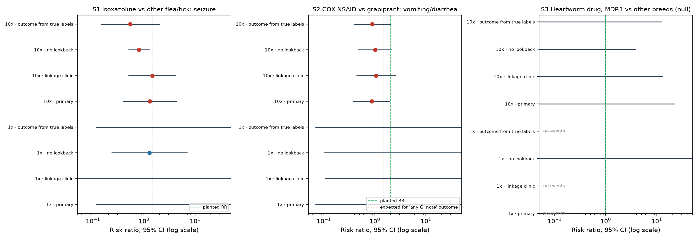
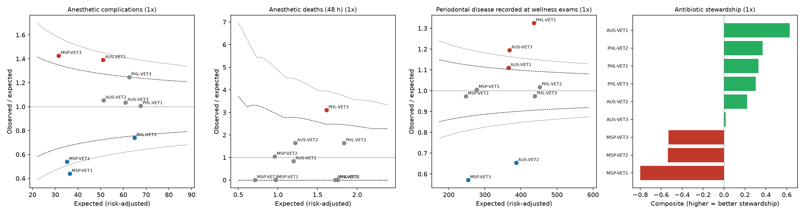
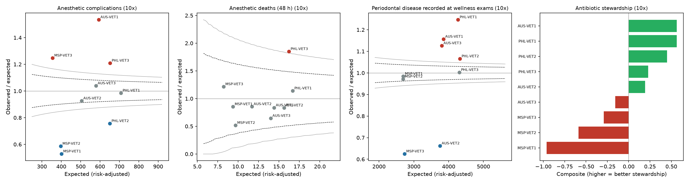
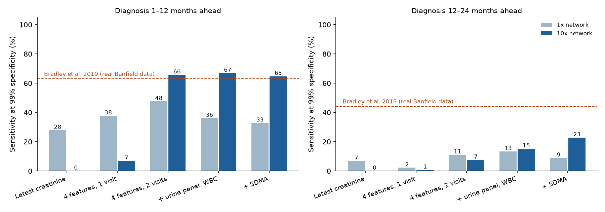
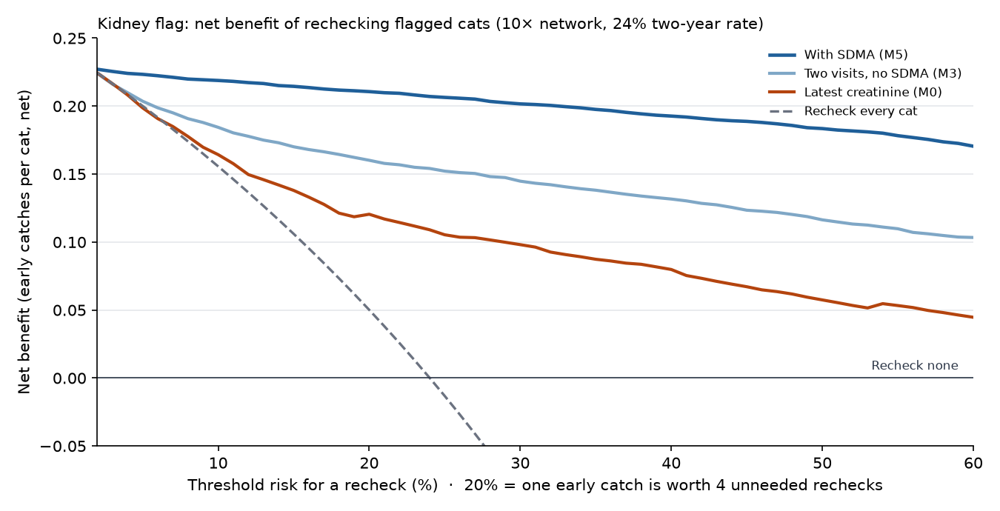

# TailSignal: linking multi-channel pet care records for pharmacovigilance, clinical quality and early disease detection

**Chris Lavelle** · October 2026 · Code and data pipeline: [github.com/RonCom/tailsignal](https://github.com/RonCom/tailsignal)

## Abstract

**Background.** Companion-animal health data are split across veterinary clinics, daycare and boarding, grooming and
wellness plans, none of which share an identifier. Linking them could support drug-safety surveillance, clinic
quality measurement and earlier detection of chronic disease, but each use depends on linkage quality, privacy,
statistical power and outcome definitions that are rarely measured together.

**Methods.** We built an end-to-end platform on simulated partner records (six systems, 26,099 pet records, 2022–2025)
calibrated to published veterinary studies, plus three real public sources: 1,357,337 FDA Center for Veterinary
Medicine adverse-event reports, 26,396 FDA NARMS dog isolates and 4,999 UK first-opinion clinic notes (SAVSNET PetEVAL).
Eight hypotheses and every subsequent analysis were specified in writing before analysis. Methods include two-stage
probabilistic record linkage, k-anonymous release, a hierarchical gamma-Poisson model for breed-specific drug-safety
signals, new-user active-comparator cohorts, staged outcome dictionaries, risk-adjusted funnel-plot benchmarking with
empirical-Bayes shrinkage, gradient-boosted kidney-disease prediction, hierarchical forecasting with conformal
recalibration, Gaussian-mixture segmentation and meta-learner uplift models.

**Results.** Two-stage linkage reached F1 0.983 against 0.904 for a deterministic rule. On 970,167 real dog reports, the
hierarchical drug-safety model produced 0 false breed-specific signals per 1,000 cells under a permutation null (0.0 vs
7.3 unpooled), ranked the known MDR1 breed sensitivity to macrocyclic lactones 16th–30th rather than 235th–1,545th,
and replicated on 2020–2026 reports; it did not detect the isoxazoline seizure signal before the 2018 FDA alert at
the pre-registered threshold. Methicillin resistance in *S. pseudintermedius* skin isolates rose from 31% to 43%
(2017–2024; OR 1.07 per year). Risk-adjusted complication benchmarks ranked clinics with Spearman 0.97 against true
quality at current volume; death rates required about 5,000 procedures per clinic. A feline chronic kidney disease
model using two lab visits and SDMA reached AUC 0.965 (0.957–0.972), held at 0.96 under simulated confounders and gave
positive net benefit across thresholds of 5–50%. A seizure dictionary fell from 75% precision on simulated notes to
30% on real notes, while recovering all 15 clear seizures in 150 notes PetEVAL files under nervous-system disease. Four
hypotheses failed outright or in part: segmentation stability as specified, forecast interval calibration (later
fixed), cross-channel early warning and uplift targeting.

**Conclusions.** Linkage quality and network size decide which products are viable. Breed-aware
shrinkage makes drug-safety screening specific enough to act on; clinic quality and resistance products work at
modest scale; rare-event drug-safety studies need roughly 130 times a nine-clinic network.

## 1. Introduction

A pet's health record is scattered. Illness and prescriptions sit in a practice-management system, behavior and
attendance in a daycare booking system, skin and coat observations in a groomer's notes, and loyalty in a wellness-plan
database. Corporate groups now own about 30% of US veterinary practices and over half of companion-animal revenue
(AVMA 2025), and some operators own every service line, which makes linking these records commercially realistic.

Linking these records raises three questions:

1. Can records be linked across businesses accurately enough, and released privately enough, to be useful?
2. Which analyses produce results a buyer could act on, and at what network size?
3. What fails, and why?

We built a working platform to address them and pre-registered each analysis; negative results are reported
alongside positive ones.

### 1.1 Contributions

- A two-stage linkage design (households, then pets) that fixes a sibling-merging failure of single-stage linkage.
- A hierarchical extension of the multi-item gamma-Poisson shrinker for breed-specific drug-safety signals, evaluated
  against a permutation null, a fixed review budget, a verified label set and a held-out confirmatory period.
- Power and linkage requirements for veterinary EHR drug-safety cohorts, stated as network multiples.
- An independent check of a veterinary seizure dictionary on real clinic text, including measured recall and
  self-agreement.
- A feline kidney early-warning model with a pre-registered stress test and decision-curve analysis.
- Scale gates that convert each statistical result into a commercial unlock point.

## 2. Related work

**Pharmacovigilance.** Disproportionality measures (proportional reporting ratio, reporting odds ratio) and the
empirical-Bayes multi-item gamma-Poisson shrinker (MGPS; DuMouchel 1999) are standard for spontaneous reports. Breed is
rarely modeled, although breed-specific drug sensitivity is well established for MDR1 (ABCB1) variants in herding
breeds. FDA issued an alert on neurologic events with isoxazoline parasiticides in September 2018.

**Veterinary EHR epidemiology.** Davies et al. (2025) set out how first-opinion EHRs support pharmacoepidemiology,
including new-user designs and text-mined outcomes. VetCompass and SAVSNET have shown the value of UK practice data;
PetEVAL (Farrell et al. 2025) released annotated clinic notes as a benchmark.

**Clinic benchmarking.** Funnel plots with exact Poisson limits (Spiegelhalter 2005) and empirical-Bayes shrinkage are
standard in human-hospital profiling. Anesthetic mortality in small animals was characterized by CEPSAF (Brodbelt et al.
2008).

**Feline chronic kidney disease.** Bradley et al. (2019) trained a recurrent neural network on 106,251 Banfield cats
using creatinine, BUN, urine specific gravity and age, reporting sensitivity at about 99% specificity of 63% one year
and 44% two years before diagnosis. SDMA rises earlier than creatinine and depends less on lean body mass (Hall et al. 2014). Hyperthyroidism masks azotemia (Peterson et al. 2018).

## 3. Data

### 3.1 Simulated partner network

A generator produces six partner systems from a fixed seed: three veterinary practice-management systems (CSV,
JSON lines and pipe-delimited text, each with its own diagnosis coding), a daycare and boarding system, a grooming
system and a wellness-plan system with reminder campaigns. Records carry realistic defects: breed misspellings, phone
formats, missing microchips and transcription errors.

| Quantity | Value |
|---|---|
| Households | 8,490 |
| Source pet records | 26,099 |
| True pets | 12,428 |
| Clinics | 9 (3 markets) |
| Period | 2022–2025 |

A clinical EHR layer adds what sits inside a clinic's records (Table 1), regenerated from the same seed so earlier
results are unchanged. A separate 10× world (about 90,000 households) supports power analyses.

**Table 1.** Clinical EHR layer, actual network.

| Table | Rows | Contents |
|---|---|---|
| Visits | 61,527 | Visit type, diagnosis, weight, body condition score, dental grade |
| Prescriptions | 47,635 | Flea and tick (isoxazoline vs other), heartworm, NSAIDs, antibiotics |
| Procedures | 4,995 | Dentals, spay and neuter, mass removal, orthopedic surgery; ASA class, complications, 12 deaths |
| Lab results | 99,687 | Creatinine, BUN, SDMA, urine specific gravity, urine protein:creatinine, pH, WBC |
| Culture results | 7,539 | Each isolate a real NARMS dog isolate drawn by organism, site, region and year |
| Clinical notes | 61,527 | Abbreviations, misspellings, negations, history mentions |
| Patient records | 12,990 | One per pet per clinic; microchips captured unevenly |

**Calibration.** Parameters were set from published studies: Banfield and Waltham oral health data, VetCompass,
CEPSAF anesthetic mortality, IRIS kidney staging and SDMA literature. Planted effects (a drug side effect, clinic
quality differences, kidney decline, segment behavior, reminder effects) provide ground truth. Of 35 validation checks,
26 pass; 6 were revised for stated reasons and pass in revised form, and 3 are misses (Figure 1).

**Figure 1.** Simulator validation: dental charting and anesthetic complications by clinic against expected, cat
kidney labs before diagnosis, and critically important antibiotic use against planted propensity.

### 3.2 Real public data

| Source | Records | Period | Use |
|---|---|---|---|
| FDA CVM adverse-event reports (openFDA) | 1,357,337 reports; 970,167 dog reports with a drug and a reaction; 144,967 cat reports | 1987–2026 | Model A |
| FDA NARMS animal pathogen data (Vet-LIRN, NAHLN) | 500,268 interpretable tests on 12,958 *E. coli* and 13,438 *S. pseudintermedius* dog isolates | 2017–2024 | Resistance trends |
| SAVSNET PetEVAL (test split) | 4,999 UK first-opinion clinic notes with ICD-11 chapter labels | | Text-mining validation |
| Census County Business Patterns; city pet licenses | Establishment counts; license records | | Market context |

### 3.3 Pre-registration

Eight hypotheses (H1–H8) were committed before model fitting. Each later analysis has its own specification written
before its code ran, with expectations scored in its results file. Amendments are dated and state whether results had
been seen. Validation rules: time-based holdouts for temporal models, household-level splits, bootstrap intervals on
headline metrics, and a simple baseline for every model.

## 4. Methods

### 4.1 Linkage and taxonomy

Staging models normalize names, phones, dates, units and species. Breeds map through exact aliases, then fuzzy
matching, then human review; diagnoses from three coding schemes and free text map to 12 conditions plus wellness.
Linkage is two-stage: a Splink (Fellegi-Sunter) model resolves households on owner fields; pets are then matched within
each household on name, species, breed and birth date. The baseline links records with the same phone and pet name.

### 4.2 Privacy

Released cohorts satisfy k-anonymity with k = 10 on species, breed group, birth period, geography and sex. Records are
generalized progressively (birth year and 3-digit ZIP; 5-year band and 3-digit ZIP; 5-year band and metro) before
suppression. dbt tests fail the build if any product violates k or contains a direct identifier.

### 4.3 Model A: breed-aware drug-safety signals

For each drug–event pair, MGPS fits DuMouchel's two-gamma mixture prior to all cells, with expected counts stratified by
report year; a signal is EB05 ≥ 2. Our hierarchical extension models each breed-stratum cell as
λijs ~ Gamma(α, α/μij), where μij is the all-dog MGPS posterior mean for the pair and α
is estimated by marginal likelihood across stratum cells. This shrinks a breed estimate toward the all-dog estimate, not
toward 1; the breed-specific excess is the posterior of λijs/μij. Breed strata: MDR1
high-frequency breeds (31,159 reports), MDR1 low-frequency breeds (52,952), other purebred (613,971) and mixed or
unknown (272,085).

Evaluation:

1. **False-signal rate** under a permutation null: event sets shuffled across reports within report year (and,
   separately, breed strata), keeping marginals; 20 replicates.
2. **Positive controls:** macrocyclic lactones × neurologic events in MDR1 breeds (breed-specific); isoxazolines ×
   neurologic events (class, FDA alert 2018-09-20).
3. **Fixed review budget** (amendment, made before ranks were computed): each method ranks cells by its own score each
   quarter; equal K means equal alert volume.
4. **Verified label set:** eight label-listed reaction–product pairs checked against US labels.
5. **Confirmatory test** on reports received from 2020-01-01, all priors refit, with five predictions fixed in
   advance.

### 4.4 Model A2: drug-safety cohorts in clinic records

New-user, active-comparator cohorts following Davies et al. (2025): 180-day look-back, exclusion of pre-existing signs,
a 50-day risk window, propensity weighting and exact conditional confidence intervals for sparse counts. Three studies:
isoxazoline vs other flea and tick products for seizures (planted RR 1.5); COX-inhibiting NSAID vs grapiprant for
vomiting or diarrhea (planted RR 2.0 for drug-related events); and heartworm preventives in MDR1 breeds as a negative
control. Linkage variants compare perfect linkage, clinic-only follow-up, microchips and pet-detail matching.

Outcomes come from staged dictionaries: (1) real VeDDRA terms from the FDA reaction file; (2) spelling variants,
abbreviations and co-occurrence words, each reviewed; (3) rules for negation, history and false friends ("fit and
well"); and a TF-IDF logistic classifier trained on 2,000 annotated notes.

**Real-text validation.** The frozen stage-3 seizure dictionary was run on PetEVAL. All 60 hits were judged by hand. An
independent check, specified before running, compared those verdicts with PetEVAL's ICD-11 chapter labels and measured
recall on all 150 records labelled "Diseases of the nervous system", read with the dictionary output hidden.

### 4.5 Antimicrobial resistance

Logistic regression of resistance on year, region and site, by organism and drug. The pre-registered pooled analysis
was replaced after artifacts were found (Section 5.4): trends are estimated within site, only for drugs tested on at
least 90% of isolates every year and classed resistant in under 95%. Methicillin-resistant *S. pseudintermedius*
(MRSP) has its own pre-registered analysis using every oxacillin result. Antibiogram cells with fewer than 30 isolates
are not reported (CLSI M39).

### 4.6 Clinic benchmarks

Expected counts come from logistic models: anesthetic complications and 48-hour deaths on ASA group, emergency,
brachycephalic breed, species, procedure, age band and dogs under 5 kg; recorded periodontal disease on species, size,
age band and overweight. Observed/expected (O/E) ratios are plotted against Spiegelhalter-interpolated exact Poisson
95% and 99.8% funnel limits. Log O/E is shrunk toward the network mean (between-clinic variance by method of moments);
2,000 posterior draws give 90% rank intervals. Stewardship is a composite of z-scored process measures (culture before
UTI treatment, first-line choice, critically important antibiotics as first choice, metronidazole for acute diarrhea,
antibiotics with dentals).

### 4.7 Feline chronic kidney disease

Unit: a cat's lab panel with an earlier panel 90–900 days before it. Outcome: first CKD diagnosis 30–730 days after
the index panel; diagnoses within 30 days are excluded as already diagnosable, and negatives need 730 days of follow-up.
Six models: M0 latest creatinine; M1 an IRIS-style rule (creatinine ≥ 1.6 mg/dL or SDMA ≥ 18 µg/dL); M2 logistic
regression on age, creatinine, BUN and urine specific gravity at one visit; M3 gradient boosting on the same four at
two visits plus change per year; M4 adding urine protein:creatinine, pH and WBC; M5 adding SDMA. Evaluation: five-fold
cross-validation grouped by cat, cat-bootstrap intervals, sensitivity at 95% and 99% specificity by lead time,
calibration.

**Stress test** (specified before running): untreated hyperthyroidism in 15% of cats from age 10–16 for 6–18 months
(creatinine × 0.65, SDMA × 0.80, BUN × 0.85, USG − 0.008, from Peterson et al. 2018 and Bestwick et al. 2026);
dehydration at 10% of panels (creatinine × 1.25, BUN × 1.40, SDMA × 1.15, USG + 0.008; assumed); muscle loss from age 12
(creatinine − 2% per year; assumed). Models were also trained on panels before the median index day and tested on later
panels from unseen cats.

**Decision-curve analysis** (Vickers and Elkin 2006): net benefit = TP/N − FP/N × p/(1 − p) at threshold p, compared with
rechecking all or no cats; repeated after reweighting to a 10% two-year diagnosis rate.

### 4.8 Segmentation, forecasting, early warning and uplift

- **Segmentation (H7):** Gaussian mixture, k by BIC with no segment under 5%; stability by bootstrap Jaccard over 50
  refits, bar 0.75.
- **Forecasting (H8):** weekly demand for four services in a service → market → location hierarchy (43 series);
  seasonal naive and MSTL with an ETS trend, reconciled bottom-up and by MinT shrinkage; 12 rolling origins 4 weeks
  apart, 13-week horizon. Intervals were later recalibrated by sequential split conformal prediction using only errors
  observable at each origin.
- **Early warning (H5):** pet-month snapshots (392,838); outcome a sick vet visit within 60 days; vet-history model vs
  vet history plus cross-channel features; power study over simulated warning-signal strengths; ablation separating
  engagement from warning signals.
- **Uplift (H6):** randomized reminders at month 6 (2,927 memberships); T- and X-learners vs lapse-risk targeting,
  scored as members kept per 1,000 contacts on a later test period.

## 5. Results

### 5.1 Linkage and privacy (H1, H2)

**Table 2.** Pet-level linkage.

| Method | Precision | Recall | F1 |
|---|---|---|---|
| Same phone and pet name | 0.992 | 0.830 | 0.904 |
| One-stage Splink over pets | 0.48 | | |
| **Households, then pets** | **0.990** | **0.975** | **0.983** |

H1 is supported: F1 ≥ 0.95 and recall 14.5 points above the baseline at equal precision. The single-stage model failed
because siblings share every owner field. Breed mapping resolved 110 of 114 raw strings automatically.

H2 is partly supported: k = 10 holds for every released record, but 8% of pets are suppressed against a 5% target
(19% released at birth year and 3-digit ZIP, 67% at 5-year band and 3-digit ZIP, 6% at 5-year band and metro).
Suppression falls as the network grows.

### 5.2 Breed-aware drug safety (H3)

**Table 3.** False signals per 1,000 cells under a permutation null (20 replicates).

| Method | All-dog cells | Breed-specific cells |
|---|---|---|
| PRR | 43.2 | |
| ROR | 68.6 | |
| Unpooled interaction ROR | | 7.3 |
| MGPS (EB05 ≥ 2) | 0.0 | |
| **Hierarchical mixture** | 0.0 | **0.0** |

**MDR1 control.** Pooled over all dogs, macrocyclic lactones × neurologic events show no signal (EBGM 0.78). The
hierarchical model flags MDR1 high-frequency breeds at 1.20× the all-dog rate (5th percentile 1.15); no other stratum
shows an excess (5th percentiles 0.86–0.99); P(MDR1-high rate > other-purebred rate) > 0.999. The unpooled interaction
ROR also flags the stratum (1.47) but would raise about 6,600 false breed alerts across ~900,000 stratum cells.

**Table 4.** Rank of the MDR1 breed signal among all stratum cells at equal review effort.

| Quarter | Stratum cells | Unpooled interaction ROR | Hierarchical |
|---|---|---|---|
| 2013 Q1 | ~35,000 | 235 | **16** |
| 2016 Q1 | ~67,000 | 833 | **26** |
| 2019 Q1 | ~101,000 | 1,545 | **30** |
| 2019 Q4, lack-of-effect reports removed (exploratory) | ~101,000 | 1,820 | **1** |

**Isoxazoline control.** Isoxazolines × neurologic composite: 27,351 reports vs 20,416 expected (EBGM 1.34), below the
EB05 ≥ 2 threshold; neither PRR nor MGPS flagged it before the alert. Three causes: masking by a parasiticide-dominated
database in which about a quarter of dog reports are lack-of-effectiveness reports; self-inflation (isoxazolines account
for about half of all dog "Seizure NOS" reports); and dilution of the composite by ataxia and trembling. Post hoc, with
lack-of-effectiveness reports removed, PRR flagged isoxazoline seizures 4.5 years before the alert, at a 43 per 1,000
false-signal rate, and MGPS a year after.

**Table 5.** Within-product rank of isoxazoline seizure signals at equal review effort.

| Target | Terms on list | PRR | ROR | MGPS |
|---|---|---|---|---|
| Isoxazolines × seizure, 2016 Q2 | 885 | 232 | 104 | **76** |
| Isoxazolines × seizure, 2018 Q2 | 1,277 | 275 | 91 | **57** |
| Isoxazolines × neurologic composite, 2018 Q2 | 1,277 | 774 | 510 | **118** |
| Afoxolaner × seizure, 2018 Q2 | 810 | 98 | 37 | **32** |
| Sarolaner × seizure, 2018 Q2 | 402 | 42 | **14** | **14** |

**Label-listed reactions.** For common reactions (vomiting with NSAIDs, cyclosporine, spinosad), every method ranks
the labeled reaction low (MGPS ranks 53–879) because vomiting is the most-reported dog reaction overall; ROR's lower
bound does slightly better. For distinctive reactions (melarsomine injection-site pain and swelling, selamectin
application-site alopecia in cats) all three methods rank them in the top 30. MGPS's advantage is specificity and
breed-level shrinkage, not recall of common reactions.

**Cats.** False signals per 1,000: PRR 36.9, ROR 57.6, MGPS 0.0. Sarolaner × seizure in cats: EB05 10.6 (102 reports vs
8 expected), at or near the top of its product list under every method.

**Table 6.** Confirmatory test, reports from 2020-01-01 (305,744 dog and 58,902 cat reports).

| # | Prediction | Result | Pass |
|---|---|---|---|
| P1 | Dogs: isoxazolines × seizure/tremor EB05 ≥ 2 | 14,393 vs 9,524 expected; EB05 1.49 | No |
| P2 | Dogs: each isoxazoline has seizure/tremor in its top 10 | Sarolaner 9th; others 66th–201st | No (1 of 4) |
| P3 | Cats: isoxazolines × seizure/tremor EB05 ≥ 2 | EB05 1.34 | No |
| P4 | Dogs: MDR1-high excess for macrocyclic lactones × neurologic | Ratio 1.12 (5th percentile 1.05) | Yes |
| P5 | Dogs: MGPS false signals ≤ 1 per 1,000 | MGPS 0.0; PRR 19.0; ROR 32.1; breed excess 0.0 vs 5.4 | Yes |

H3 verdict: lower false-signal rate supported; breed-specific detection supported; earlier isoxazoline detection not
supported; both method claims replicate on new data.

### 5.3 Drug-safety cohorts in clinic records

At the actual network size the isoxazoline cohort has 986 exposed and 616 comparator dogs with 2 and 0 seizures; the
studies cannot answer their question, as expected. At 10×, isoxazoline seizures give RR 1.29 (95% CI 0.39–4.29) with
propensity weighting and 1.44 (0.50–4.14) with perfect linkage, against a planted 1.5 (Figure 2). Confirming a 1.5× risk
needs about 81,000 dogs per arm, roughly 130× this network's comparator group; common events need about 80×.

**Figure 2.** Risk ratios with 95% intervals by study, network size and design variant.

- **Look-back prevents channeling bias.** Without 180 days of history, dogs with prior seizures cannot be excluded and the estimate
  falls to RR 0.80 (0.50–1.27): channeling bias, because epileptic dogs are steered away from isoxazolines.
- **Pet-detail linkage fails at scale.** Name, breed, sex and birth year link 99% of true cross-clinic pairs, but only
  49% of proposed links are correct at 1× and 4% at 10×; false merges shrank the 10× isoxazoline cohort from 9,879 to
  6,170 dogs. Microchips are always right but link 31% of pairs.
- **Vague outcomes dilute effects.** About half of GI visits are unrelated to the drug, so "any GI note" can show at
  most about 1.5 of a planted 2.0; the 10× estimate is 0.87 (0.38–1.96).
- **Negative control behaves:** 0 neurologic events in 753 MDR1 dogs vs 4 in 10,989 (exact upper bound RR 22).
- **Onset (real data):** among 13,407 FDA dog reports linking an isoxazoline to seizures with both dates, median onset
  is 2 days, 90th percentile 61 days; 89% begin within 50 days.

**Table 7.** Outcome dictionaries on simulated notes (61,527 notes).

| Outcome | Stage | Precision | Recall |
|---|---|---|---|
| Seizure | 1: VeDDRA terms | 2% | 47% |
| | 2: + variants, abbreviations, co-occurrence | 3% | 83% |
| | 3: + negation, history, false friends | 75% | 71% |
| | Classifier | 96% | 100% |
| Vomiting/diarrhea | 3 | 99% | 98% |
| Neurologic signs | 3 | 100% | 84% |

**Table 8.** Seizure dictionary on real UK clinic notes (PetEVAL).

| Check | Expected | Result |
|---|---|---|
| Frozen stage-3 precision | | 30% (18 of 60); 35% counting differentials |
| With post-hoc "fit" rules (written after reading these hits) | | 64% (optimistic) |
| My true hits carrying PetEVAL's nervous-system label | ≥ 80% | 100% (18 of 18) |
| My false hits carrying it | ≤ 15% | 8% (3 of 39) |
| Recall on clear current or recent seizures | ≥ 70% | 100% (15 of 15; exact 95% CI 78–100%) |
| Recall including possible episodes | | 74% (23 of 31) |
| True seizures lost by post-hoc rules | ≤ 1 | 0 |
| Self-agreement on 24 notes read twice | | 75%; Cohen's κ 0.48 |

37 of 39 false hits came from the VeDDRA term "Fit" in its everyday British sense ("fit for vaccination", "fit to
travel", "muzzle fits well"). Under the stricter second reading, frozen precision would be 25%. A clinical second
reader is required before the dictionary supports drug-safety work.

### 5.4 Antimicrobial resistance

MRSP made up 36.5% of *S. pseudintermedius* isolates. In skin and other sites it rose from 31% (2017) to 43% (2024),
and in urine from 20% to 32%; adjusted for region and site, odds rose 7% a year (OR 1.07, 95% CI 1.05–1.09). All 16
significant rising trends were in *S. pseudintermedius* (for example clindamycin 31% → 43%, enrofloxacin 36% → 49%;
multidrug resistance 28% → 41%). All 7 falling trends were in *E. coli* (urinary multidrug resistance 17% → 13%).
MRSP was highest in the Northeast (42%) and South (41%).

**Figure 3.** Resistance in dog clinical isolates, FDA NARMS, 2017–2024.

The pre-registered pooled analysis found 19 rising and 10 falling trends, several of them artifacts: site-specific
breakpoints (*E. coli* amoxicillin-clavulanate about 1% "resistant" in urine and about 100% from tissue), breakpoints
below the wild type, and selective cascade testing of second-line drugs. Both versions are published.

**Table 9.** Regional urinary antibiogram, *E. coli*, 2022–2024, percent susceptible.

| Drug | Canada | Midwest | Northeast | South | West |
|---|---|---|---|---|---|
| Amoxicillin-clavulanate | 100% | 100% | 97% | 100% | 100% |
| Trimethoprim-sulfamethoxazole | 93% | 91% | 91% | 91% | 95% |
| Enrofloxacin | 95% | 88% | 87% | 83% | 91% |
| Cefpodoxime | 93% | 87% | 83% | 79% | 88% |
| Isolates (max per cell) | 108 | 1,918 | 233 | 1,443 | 267 |

### 5.5 Clinic benchmarks

At about 555 anesthetics per clinic over four years, complication O/E ranked clinics with Spearman 0.97 against planted
quality (0.98 at 10×), with every flag in the right direction (Figure 4). Each clinic expected 0.7–1.8 deaths in four
years; power to detect a doubled death risk was 13%, and the estimated between-clinic variance was zero. At 10× (about
5,600 procedures per clinic) the high-mortality clinic was flagged beyond the 99.8% limit with 81% power (Figure 5); the
threshold is roughly 4,750–5,250 procedures per clinic. Both under-charting clinics recorded about two thirds of expected
periodontal disease (O/E 0.65 and 0.57), and the stewardship composite matched planted prescribing (Spearman 0.97).
Six of nine clinics have 90% rank intervals spanning four or more positions.

**Figure 4.** Funnel plots for complications, deaths and dental charting, and stewardship composite; actual network.

**Figure 5.** The same measures at 10× volume.

### 5.6 Oral health

About 9.4% of dogs seen per year were diagnosed with dental disease (95% CI 9.1–9.8%); toy breeds had 2.5 times the
odds after adjusting for age (OR 2.49, 2.17–2.85); prevalence rose from 3.8% under age 2 to 15.4% at 12 and over; 46% of
diagnosed dogs had a cleaning the same year. Comparison with Banfield and VetCompass exposed four simulator gaps
(small-breed risk, overweight link, detection at wellness exams, clinic charting differences), which the EHR layer
addresses (Section 3.1).

**Figure 6.** Dental disease by breed size and age.

### 5.7 Feline chronic kidney disease

**Table 10.** Model comparison, 10× network (4,856 index panels, 3,567 cats, 1,166 future diagnoses).

| Model | AUC (95% CI) | Sensitivity at 95% specificity | At 99%, diagnosis 12–24 months ahead |
|---|---|---|---|
| M0 Latest creatinine | 0.787 (0.769–0.802) | 41% | 0% |
| M1 IRIS-style rule | 0.784 (0.770–0.798) | 81% at specificity 76% | n/a |
| M2 Four features, one visit | 0.861 (0.847–0.875) | 49% | 1% |
| M3 Four features, two visits | 0.894 (0.882–0.905) | 64% | 7% |
| M4 + urine panel, WBC | 0.918 (0.908–0.928) | 72% | 15% |
| M5 + SDMA | **0.965** (0.957–0.972) | **91%** | **23%** |

M5's Brier score was 0.047, with observed rates tracking predicted risk across deciles. At 99% specificity M5 flagged
65% of cats diagnosed within a year (Bradley et al.: 63%) and 23% of those diagnosed 12–24 months later (44%). All three
pre-stated expectations were confirmed. At the actual network size results were noisier (the one-visit model edged the
two-visit model, 0.939 vs 0.922).

**Figure 7.** Sensitivity at 99% specificity by lead time, against Bradley et al. (2019).

**Table 11.** Stress test, AUC.

| Model | Original | Time split | Confounders | Confounders, time split | Heavier confounders (exploratory) |
|---|---|---|---|---|---|
| M0 | 0.787 | 0.795 | 0.731 | 0.739 | 0.698 |
| M3 | 0.894 | 0.898 | 0.884 | 0.882 | 0.876 |
| M4 | 0.918 | 0.921 | 0.913 | 0.912 | 0.909 |
| M5 | 0.965 | 0.967 | 0.962 | 0.967 | 0.959 |

All four stress-test expectations were met: the time split changed AUC by under 0.02; confounders cut the
creatinine-only AUC by 0.056; M5 lost less than M3 (0.003 vs 0.010); and M5 stayed above 0.90 on later data.

**Decision curve.** M5 had the highest net benefit at every threshold from 5% to 50% (at 20%: 0.211 vs 0.160 for M3,
0.121 for creatinine and 0.050 for rechecking every cat), and confounders barely changed it (0.209). At M5's
95%-specificity threshold, a clinic performs 1.17 rechecks per cat later diagnosed. The expectation that this would
double at 10% prevalence failed: it rose to 1.49.

**Figure 8.** Net benefit of rechecking flagged cats by threshold probability.

### 5.8 Segmentation, forecasting, early warning and uplift

**Segmentation (H7): fails as specified.** With eleven features including household attributes, BIC chose k = 4 and
bootstrap Jaccard was 0.36–0.68. Clustering on five behavioral rates (amendment logged before rerunning) gave three
stable top-level segments (Jaccard 0.76–0.94) and six finer ones: daycare regulars were 22% of households and 64% of
revenue.

**Forecasting (H8): fails on calibration, later fixed.** MSTL + MinT beat seasonal naive on MASE (0.828 vs 0.889) but
80% intervals covered 64% of outcomes. Sequential split conformal intervals covered 82% overall and 82–83% in every
horizon band, 32–45% wider than MinT's. Staffing to any upper bound cost more than staffing to the point forecast,
because rounding to whole handlers already adds slack; the pre-stated expectation that conformal staffing would cost no
more than MinT staffing failed.

**Early warning (H5): fails.** Cross-channel features lifted 60-day AUC from 0.709 to 0.715 (+0.007, 95% CI
0.005–0.008). With no warning signal planted, the lift was still 0.009: it reflects engagement. The ablation's warning
component was indistinguishable from zero across all pets and reached +0.008 only for pets active in other channels.

**Uplift (H6): fails.** Reminders cut 180-day lapse from 14.1% to 12.4% on average. On 287 test memberships, uplift
targeting kept 58 members per 1,000 contacts (95% CI −93 to 193) against −82 for risk targeting; the difference, 140
(−14 to 273), includes zero. Targeting by the true effect would keep 93 per 1,000, so the value exists but the pilot is
too small to learn it. Detecting a 5-point difference in effect between two segments needs about 6,000 households.

## 6. Discussion

**Linkage decides what is possible.** Every downstream product rests on recognizing the same pet across businesses.
The two-stage design worked because it mirrors how records are shared within households. Because
pet-detail matching in clinic records fails (4% precision at 10×), owner identifiers must be negotiated into data
agreements.

**Shrinkage makes screening actionable.** In a database of nearly a million dog reports, frequentist screens raise
40–70 chance alerts per 1,000 cells. The hierarchical model raises none and still finds a breed-specific risk that
pooled analysis hides. Its cost is speed: the threshold that keeps false alarms near zero missed the isoxazoline signal
until after the alert. A program would queue cases with a frequentist screen and prioritize them with the
Bayesian score, with linked clinic data (exposure counts) as the confirmation step.

**Scale gates turn statistics into a growth plan.** Clinic complication benchmarks, stewardship scores, antibiograms and
breed-level drug-safety screens work now. Per-clinic death rates need about 5,000 procedures; common side-effect
studies about 80× a nine-clinic network; rare ones about 130×. These numbers set partner-recruitment targets and which
products a network can sell at each stage.

**Real data cut synthetic performance.** The seizure dictionary lost more than half its precision on real notes for a
reason no simulation would have produced. The kidney model's absolute accuracy is optimistic because the simulated
decline was generated from the same lab values, so the conclusions rest on the comparisons between models, the stress
test and the decision curve.

**Negative results.** The early-warning failure says what not to sell; the uplift failure says what
trial to run; the segmentation failure produced a better design.

## 7. Limitations

- Partner records are simulated; real records are messier and effects smaller and noisier.
- Spontaneous reports have no exposure denominator, and reporting is stimulated by publicity; Model A produces
  proportional ratios, not rates.
- NARMS isolates come from diagnostic submissions, which over-represent recurrent infections; laboratory participation
  varies by state and year.
- PetEVAL labels were judged by one reader with moderate self-agreement; recall was measured only within one ICD
  chapter.
- Kidney confounder effect sizes for dehydration and muscle loss are assumed, and confounders were applied independently
  of disease.
- The 10× scenario is a separately simulated world, not ten copies of the actual network.
- Business-case prices, volumes and company figures are planning assumptions.

## 8. Conclusion

A linked, privacy-protected pet health record supports products that individual businesses cannot build: specific
breed-aware drug-safety screening, risk-adjusted clinic quality measurement, regional resistance intelligence and
early kidney-disease flags. Which products are feasible depends on linkage through owner identifiers and on network
volume, and both requirements can be stated in advance.

## Reproducibility

All code, specifications, amendments and results files are in the repository. `uv run python -m tailsignal.pipeline`
rebuilds the platform; each analysis has a one-line command in the README. Public data are downloaded by the ingest
scripts; PetEVAL requires accepting its terms. 28 dbt tests and 26 unit tests run on every push.

## References

- AVMA (2025). *Economic State of the Veterinary Profession*, summarized by
  [dvm360](https://www.dvm360.com/view/2025-economic-state-of-the-veterinary-profession-trends-and-opportunities-for-your-practice).
- APPA (2025). [U.S. pet industry reaches $158 billion in 2025](https://americanpetproducts.org/news/u.s.-pet-industry-reaches-158-billion-in-2025-poised-for-continued-growth-in-2026).
- Bestwick J. et al. (2026). [Prevalence of disease in 549 older cats undergoing health screening at two United Kingdom-based veterinary clinics](https://pmc.ncbi.nlm.nih.gov/articles/PMC13446506/). *Journal of Veterinary Internal Medicine*.
- Bradley R. et al. (2019). [Predicting early risk of chronic kidney disease in cats using routine clinical laboratory tests and machine learning](https://escholarship.org/uc/item/7f38t7mc). *Journal of Veterinary Internal Medicine* 33:2644–2656.
- Brodbelt D. C. et al. (2008). The risk of death: the Confidential Enquiry into Perioperative Small Animal Fatalities (CEPSAF). *Veterinary Anaesthesia and Analgesia* 35:365–373.
- Davies H. et al. (2025). Developing electronic health records as a source of real-world data for veterinary pharmacoepidemiology. *Frontiers in Veterinary Science* 12:1550468.
- DuMouchel W. (1999). Bayesian data mining in large frequency tables, with an application to the FDA spontaneous reporting system. *The American Statistician* 53:177–190.
- Farrell S. et al. (2025). [PetEVAL: A veterinary free text electronic health records benchmark](https://aclanthology.org/2025.bionlp-1.29/). BioNLP 2025.
- FDA Center for Veterinary Medicine. [Animal and veterinary adverse event reports, openFDA](https://open.fda.gov/apis/animalandveterinary/event/).
- FDA. NARMS animal pathogen antimicrobial resistance data (Vet-LIRN, NAHLN).
- Hall J. A. et al. (2014). Comparison of serum concentrations of symmetric dimethylarginine and creatinine as kidney function biomarkers in cats with chronic kidney disease. *Journal of Veterinary Internal Medicine* 28:1676–1683.
- Peterson M. E. et al. (2018). [Evaluation of serum symmetric dimethylarginine concentration as a marker for masked chronic kidney disease in cats with hyperthyroidism](https://pmc.ncbi.nlm.nih.gov/articles/PMC5787157). *Journal of Veterinary Internal Medicine* 32.
- Spiegelhalter D. J. (2005). Funnel plots for comparing institutional performance. *Statistics in Medicine* 24:1185–1202.
- Vickers A. J., Elkin E. B. (2006). Decision curve analysis: a novel method for evaluating prediction models. *Medical Decision Making* 26:565–574.
