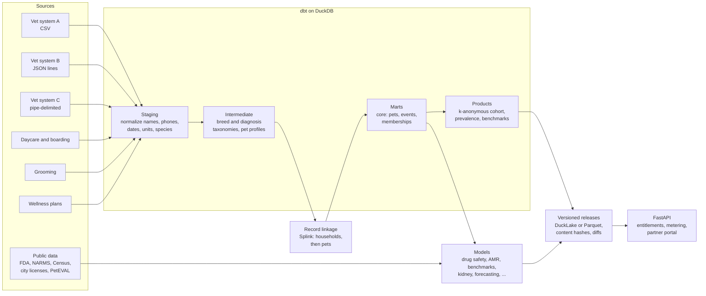

# Platform and engineering

TailSignal is built from testable parts: Python and uv, dbt models that build on DuckDB locally and on Snowflake, Splink for record linkage, FastAPI for the data API, and GitHub Actions for tests. One command
rebuilds the platform from raw files in about three minutes. Every stage that a buyer or regulator would ask about,
from linkage quality to privacy to release reproducibility, has an automated check.

## Architecture

| Layer | What it does | Where |
|---|---|---|
| Generator | Six partner systems with inconsistencies: typos in breed names, phone formats, missing microchips, three different diagnosis coding schemes | `src/tailsignal/synth/` |
| Public ingest | openFDA adverse events (flattened to Parquet), FDA NARMS isolates, Census business counts, city pet licenses, PetEVAL notes | `src/tailsignal/ingest/` |
| Staging | One model per source table: names, phones, dates, units and species codes normalized | `dbt/models/staging/` (10 models) |
| Intermediate | Breed taxonomy (exact, then fuzzy, then flagged for review); diagnosis taxonomy (codes and free text to 12 conditions plus wellness); one profile per pet per source | `dbt/models/intermediate/` |
| Linkage | Splink household model, then within-household pet matching | `src/tailsignal/er/` |
| Marts | `dim_pet`, `dim_location`, `fct_service_event`, `fct_wellness_membership` | `dbt/models/marts/core/` |
| Products | De-identified cohort, condition prevalence with suppression, service benchmarks | `dbt/models/marts/product/` |
| Releases | Build, hash, diff and publish only when content changed | `src/tailsignal/products/release.py` |
| API | Role entitlements, per-call metering, partner portal | `src/tailsignal/api/app.py` |

## Record linkage

The first job is recognizing one pet across businesses that share no ID. A single probabilistic model over pet
records reached only 0.48 precision: pets in the same household share every owner field, so it merged siblings.
Two stages fixed it.

| Method | Precision | Recall | F1 |
|---|---|---|---|
| Deterministic: same phone and same pet name | 0.992 | 0.830 | 0.904 |
| One-stage Splink over pet records | 0.48 | | |
| **Two-stage: Splink households, then pets within each household** | **0.990** | **0.975** | **0.983** |
| Household level alone | 0.971 | 0.997 | |

26,099 source records resolve to 12,666 pets (ground truth 12,428). Without owner details, linkage fails at scale:
matching clinic records on pet name, breed, sex and birth year found 99% of true pairs, but only 49% of proposed links
were right at today's size and 4% at 10×. Microchips are always right but link only 31% of pairs. **Owner identifiers
belong in every data-sharing agreement.**

## Taxonomies

114 distinct raw breed strings: 97 exact alias matches, 13 fuzzy matches (for example "Labrador Retreiver",
"Daschund"), and 4 left unmapped for human review ("Sibe", "York. Terrier", "Aus. Shepherd", "Collie"). All diagnosis
codes and free-text visit reasons from the three vet systems map to 12 conditions plus wellness. Both are enforced by
dbt tests.

## Privacy

| Control | How it is enforced |
|---|---|
| k-anonymity, k = 10, on species, breed group, birth period, geography and sex | dbt test `assert_k_anonymity` fails the build |
| No direct identifiers in any product table | dbt test `assert_no_direct_identifiers_in_products` |
| Progressive generalization before suppression | Birth year + 3-digit ZIP (19% of pets), 5-year band + 3-digit ZIP (67%), 5-year band + metro (6%), suppressed (8%) |
| Small-cell suppression in aggregate products | Prevalence cells under 10 pets are never released; a release check verifies it |
| Owner identifiers | Used inside linkage only; never reach a product |

The pre-registered target was at most 5% suppression; at 12,700 pets it is 8%. Rare breed groups need more partners
before they can be released at this granularity, which is why the business case gates data licenses at about 100
clinics.

## Data products and releases

Each release builds every product, hashes each table, and publishes only if something changed. The release log
records version, time, row counts, content hashes and a row-level diff against the previous release; any past release
reads back exactly.

| Product | Rows (release v1) | Built from |
|---|---|---|
| Pet Health Index by condition | 695 cells | k-suppressed prevalence mart |
| Pet Health Index, illness-cost composite | 139 cells | Condition index, cost-weighted |
| Drug-safety signals, all dogs | 53,656 pairs | Model A, real FDA reports |
| Drug-safety signals by breed group | 331 excesses | Model A hierarchical model |
| Regional antibiogram | 194 cells | FDA NARMS, 2022–2024, ≥ 30 isolates |
| Clinic scorecards | 9 clinics | Clinic benchmarks |
| Service benchmarks | 1,262 location-months | Partner service data |

| Release check | Result |
|---|---|
| No suppressed or under-10-pet cell is released | Pass |
| Index averages about 100 within each species, year and condition | Pass (pet-weighted means 99.2–100.2) |
| A release reads back by version and matches its recorded hashes | Pass |
| An unchanged rebuild produces no new release | Pass |
| Clinic keys cannot read other clinics; unknown keys rejected; calls metered | Pass |

**Storage.** DuckLake is the primary store: one catalog snapshot per release, with time travel by version, verified on
Windows (release v1 as snapshot 2, hashes matching on read-back). Versioned Parquet with a manifest is the automatic
fallback.

**Pet Health Index.** 100 is the network average for a species, condition and year, with beta-binomial shrinkage so
small cells are pulled toward 100. A cell at nearly double the network rate (15% vs 8%) reads 117 (90% interval
99–136): conservative by design, so insurers do not reprice on noise. Raw rates ship in the same rows.

## API

FastAPI over the latest or a pinned release (`?release=N`). Keys map to roles, roles to entitlements; every successful
call is logged (key, endpoint, rows, release) for usage billing. The partner portal (`/portal/{clinic}`) renders a
clinic's scorecard beside the network median. Interactive docs at `/docs`.

## Testing and reproducibility

| What | Count |
|---|---|
| dbt data and privacy tests | 28 |
| Python unit tests (run on every push by GitHub Actions) | 29 |
| Pre-registered specifications, each written before its code ran | One per analysis, in `docs/` |
| Fixed random seeds | Generator, simulations, bootstraps |

Dependencies are locked with `uv`. Real data is downloaded by the ingest scripts and not stored in the repository;
the PetEVAL corpus requires accepting its terms and is not redistributed.

## Snowflake

The same dbt project builds on a live Snowflake account and produces the same tables as the DuckDB build.

| Step | What happens |
|---|---|
| Load | 10 raw partner files go to a Snowflake stage and into a `RAW` schema: CSV and pipe-delimited files as text columns, the nested vet JSON as one `VARIANT` column |
| Build | dbt seeds, staging, intermediate, marts and products: 21 models and 22 tests, all passing |
| Linkage | Splink runs in Python; its 26,099-row output table is copied up so both engines use the same clusters |
| Reconcile | Every model's row count, then a row-by-row, column-by-column comparison of the core and product tables |

Dialect differences (date parsing, `arg_max`, `count(*) filter`, lists versus arrays, JSON access, hashing) sit in
one macro file, so each model has one definition. Access uses a key-pair service user with a least-privilege role;
no password or key is stored in the repository.

**Result: match.** All 22 models have equal row counts. In the row-by-row comparison, the 865,797 service events, 12,666
pets, 11,614-row de-identified cohort and 1,728-row prevalence product are identical. Two differences remain and are
understood: Snowflake reports the breed-match score as a whole percentage (every breed maps the same), and two
benchmark rows differ by half a cent of rounding.

The comparison found three defects, all fixed in both engines:

| Defect | Effect | Fix |
|---|---|---|
| Ties in a pet's most common breed, ZIP or birth date were broken arbitrarily | Two DuckDB builds disagreed on 2 pets; DuckDB and Snowflake on about 300 | Every choice has an explicit tie-break |
| Birth-year bands in the cohort product printed as "2015.0-2019.0" | Labels in the sold product | Integer bands: "2015-2019" |
| Half-year median birth years rounded to even in DuckDB and up in Snowflake | 3 pets in different birth-year groups | Round down in both |

## Path to production

| Today | In production |
|---|---|
| DuckDB locally; the same models built and reconciled on a live Snowflake account | Snowflake (or the company's warehouse) as the system of record, loaded on a schedule |
| Batch rebuild by one command | Orchestrated daily or weekly (Airflow or dbt Cloud), with freshness tests |
| Demo API keys in a config file | Keys in a secrets store; usage logs into billing |
| Simulated partner feeds | Connectors to each practice-management and booking system; the staging layer is where per-system differences are absorbed |
| Models run as scripts | Model cards, calibration reports and drift monitoring before any score is sold |
